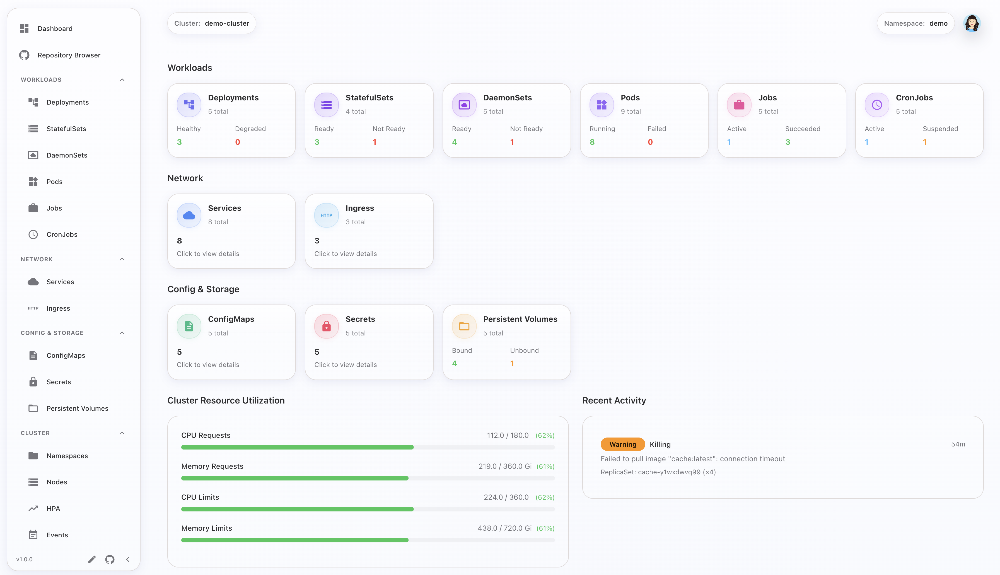

<div align="center">
  <picture>
    <source media="(prefers-color-scheme: dark)" srcset="app/public/logo.svg">
    <source media="(prefers-color-scheme: light)" srcset="app/public/logo-dark.svg">
    
  </picture>
  <h1>Orphelix</h1>

[](https://github.com/dmakowski/orphelix)
[](LICENSE)
[](https://nodejs.org)
[](https://www.typescriptlang.org/)
[](https://nextjs.org/)
[](https://reactjs.org/)
[](https://github.com/dmakowski/orphelix)
[](https://claude.ai/claude-code)
</div>

> **🚧 Active Development**: This project is under active development. Features and APIs may change.
>
> **🤖 Built with AI**: Developed with [Claude Code](https://claude.ai/claude-code) - Anthropic's AI-powered coding assistant.

**Orphelix** is a comprehensive web dashboard for monitoring and managing Kubernetes resources. The application offers a demo mode with realistic test data, live updates via Server-Sent Events, pod management, topology visualization, and GitHub integration for GitOps workflows.



## ✨ Features

### 🎯 Core Capabilities
- **Multi-Cluster & Namespace Support** - Switch between clusters and namespaces seamlessly (essential for namespace-scoped access control)
- **Comprehensive Resource Management** - View and manage all Kubernetes resources: Deployments, Pods, Nodes, ConfigMaps, Secrets, Services, Ingress, Jobs, CronJobs, StatefulSets, DaemonSets, HPA, PersistentVolumes, and Events
- **Quick Actions** - Restart deployments or individual pods with a single click
- **Real-time Updates** - Server-Sent Events (SSE) with automatic reconnection and heartbeat monitoring
- **Resource Metrics** - CPU/Memory monitoring with color-coded indicators
- **Demo Mode** - Explore the full application without cluster access - no login required (perfect for demos and evaluation)

### 🔧 Advanced Operations
- **YAML Manifest Editor** - Built-in Monaco editor with syntax highlighting and Kubernetes schema validation
- **GitOps Workflow** - Edit manifests and create pull requests directly from the dashboard (code-based changes only)
- **ConfigMap Editor** - Modify ConfigMaps in-place with automatic PR creation
- **Kustomization Support** - Automatically detect and edit Kustomize base & overlay structures
- **Smart File Matching** - AI-powered automatic deployment-to-file matching using YAML comparison

### 🤖 AI-Powered Features
- **Intelligent Troubleshooting** - AI analyzes logs and identifies root causes when deployments fail
- **System Notifications** - Real-time desktop notifications for cluster issues and critical events
- **Topology Visualization** - Interactive dependency graphs showing resource relationships for deployments

### 🔐 Security & Authentication
- **Dual GitHub Authentication** - OAuth and GitHub App support with granular repository permissions
- **Server-Side Protection** - NextAuth v5 with route protection that cannot be bypassed from client
- **Local Credentials** - Uses kubeconfig from local system - no credentials stored

### 🎨 User Experience
- **Modern Glass UI** - Beautiful liquid glass design with dark/light mode support
- **Advanced Search & Filters** - Find resources quickly with powerful filtering
- **Namespace-Scoped Views** - Perfect for teams with namespace-based access control

...and this is just the beginning!

## 🗺️ What's Coming Next?

- **Resource Optimization** - Analyze CPU/memory usage against limits and suggest cost-saving adjustments
- **Advanced Log Analysis** - AI-powered troubleshooting for non-deployment issues (services, networking, configuration)
- **Cluster Cost Insights** - Track and optimize infrastructure spending
- **Multi-Cluster Dashboard** - Unified view across multiple Kubernetes clusters
- **Custom Alerts & Rules** - Define your own notification rules and thresholds

...and much more!

## 📋 Requirements

### Minimum (Demo Mode)
- **Nothing!** Just run the application and explore

### Production Mode (Real Cluster)
- **kubectl** configured with cluster access
- **GitHub OAuth App** for login authentication ([setup guide](docs/user/github/oauth-setup.mdx))

### GitOps Features (Optional)
- **GitHub App** for YAML editor and PR workflow ([setup guide](docs/user/github/github-app-setup.mdx))

> **Note**: GitHub OAuth (for login) and GitHub App (for GitOps) are separate. See [SECURITY.md](SECURITY.md#github-authentication) for details.

## 🚀 Quick Start

### Running the Application

```bash
# 🚀 ONE COMMAND SETUP - Auto-installs, builds, and configures everything!
cd app
npm run orphelix start

# That's it! First run will:
# 1. Install dependencies (if needed)
# 2. Build standalone app (if needed)
# 3. Configure orphelix.local hostname (requires sudo password)
# 4. Initialize SQLite database
# 5. Start application in background

# Open in browser
npm run orphelix open
# Or manually navigate to: http://orphelix.local:3000
# Or: http://localhost:3000

# Other commands:
npm run orphelix stop       # Stop the application
npm run orphelix status     # Check status
npm run orphelix help       # Show all commands
```

## 📖 Documentation

📚 **[Full Documentation](https://orphelix.mintlify.app)** - Complete user guide, CLI reference, developer docs, and API documentation

### 📋 Additional Resources

- **[Security & Privacy](SECURITY.md)** - Authentication, data storage, and cluster access
- **[Changelog](CHANGELOG.md)** - Version history and updates
- **[License](LICENSE)** - Apache License 2.0
