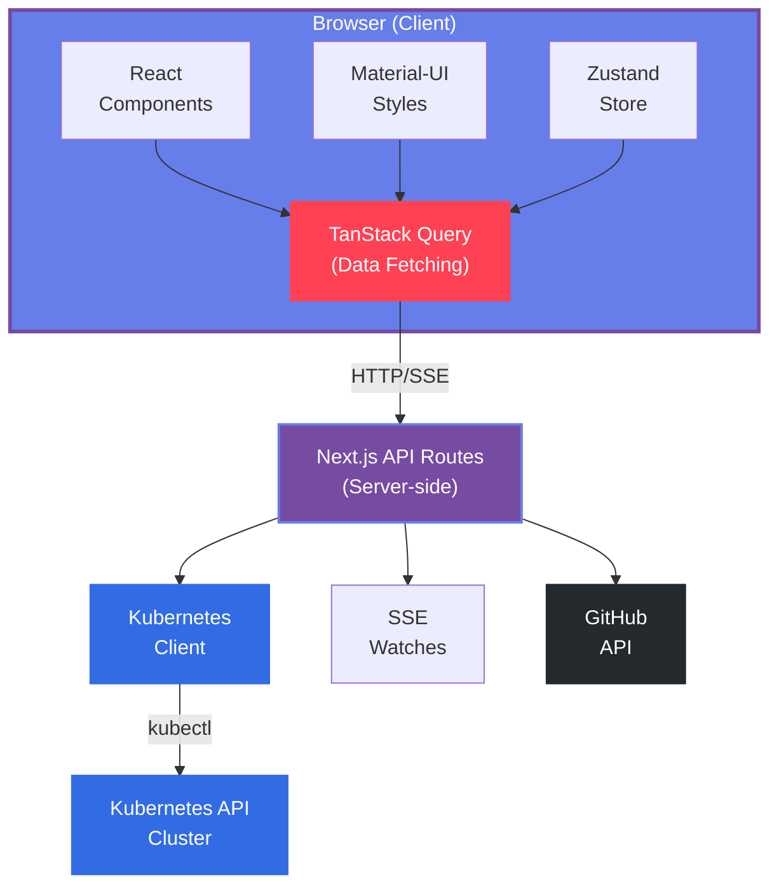
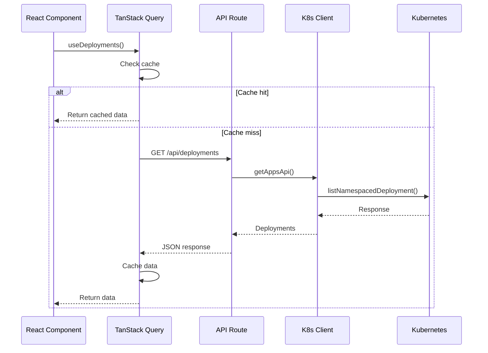
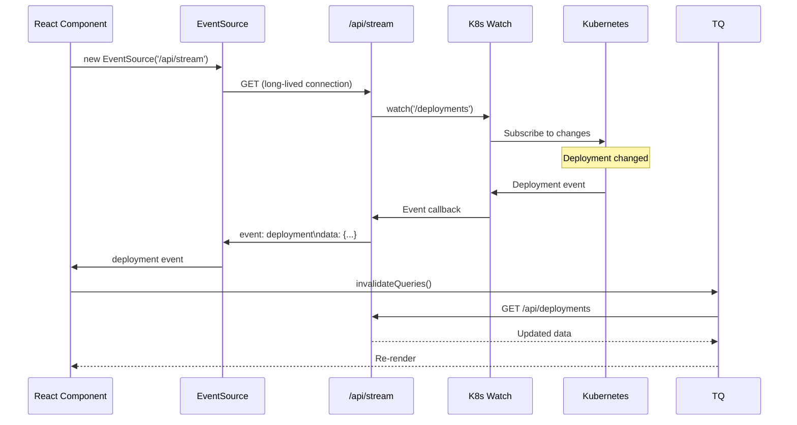
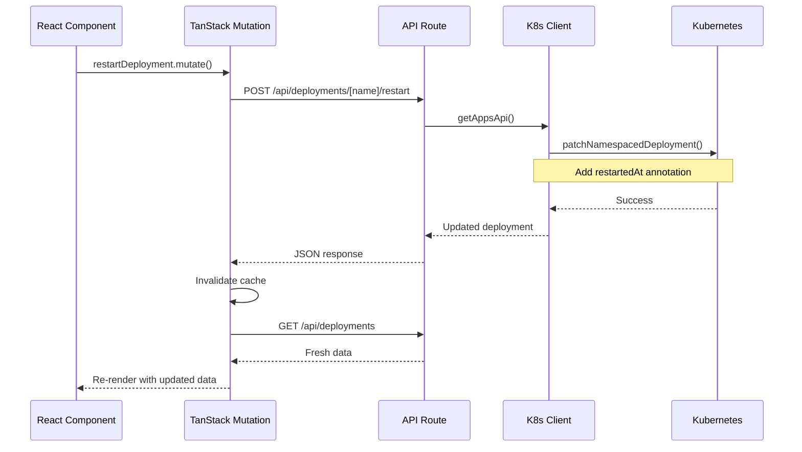

## Overview

Orphelix is built on a modern, scalable architecture that combines Next.js 15, React 19, and Kubernetes client libraries to deliver a responsive, real-time dashboard experience.

<CardGroup cols={2}>
  <Card title="Frontend Stack" icon="react">
    React 19, Material-UI v7, TanStack Query, Zustand
  </Card>
  <Card title="Backend Stack" icon="server">
    Next.js 15 API Routes, Kubernetes Client Node, SSE
  </Card>
  <Card title="Data Layer" icon="database">
    SQLite (better-sqlite3), Zustand stores, LocalStorage
  </Card>
  <Card title="Real-time" icon="bolt">
    Server-Sent Events (SSE), Kubernetes Watch API
  </Card>
</CardGroup>

## System Architecture

Orphelix follows a client-server architecture with real-time capabilities:



## Core Components

### Frontend Layer

<AccordionGroup>
  <Accordion icon="react" title="React Components">
    **Component Structure:**
    
    - `app/components/` - Reusable UI components
    - `app/app/` - Page components (Next.js App Router)
    - Material-UI v7 for design system
    - Custom glass-morphism styling (Liquid Glass preset)
    
    **Key Components:**
    
    - **Layout**: `Header`, `Sidebar`, `TopBar`
    - **Dashboard**: `StatsGrid`, `ResourceOverview`, `CriticalAlerts`
    - **Resources**: `DeploymentCard`, `PodCard`, `NodeCard`
    - **GitHub**: `FileEditor`, `PRCreator`, `RepoBrowser`
    - **Topology**: `TopologyGraph`, `TopologyNode`
    
    **Component Pattern:**
    ```typescript
    // Typical component structure
    export function DeploymentCard({ deployment }: Props) {
      // TanStack Query for data fetching
      const { data, isLoading, error } = useDeployments()
      
      // Zustand for global state
      const { mode, selectedNamespace } = useModeStore()
      
      // Material-UI for styling
      return (
        <Card sx={{ ... }}>
          <CardContent>
            {/* Component content */}
          </CardContent>
        </Card>
      )
    }
    ```
  </Accordion>

  <Accordion icon="database" title="State Management">
    **Zustand Stores:**
    
    Multiple stores for different concerns:
    
    - **`useModeStore`**: App mode (demo/real), context, namespace
    - **`useGitHubStore`**: GitHub repo, branch, pending PRs, edit basket
    - **`useClusterAliases`**: Cluster friendly names
    - **`useCriticalIssuesSettings`**: Critical issue monitoring preferences
    - **`useSidebarPins`**: Sidebar navigation pins
    
    **Persistence:**
    - Demo mode data: LocalStorage only
    - Real mode data: SQLite database synced via API
    - GitHub settings: LocalStorage
    
    **Example:**
    ```typescript
    // lib/core/store.ts
    export const useModeStore = create<ModeStore>()((set, get) => ({
      mode: 'demo',
      selectedContext: null,
      selectedNamespace: '',
      setMode: (mode) => {
        set({ mode })
        syncStateToServer(get())
      },
      // ... other actions
    }))
    ```
  </Accordion>

  <Accordion icon="arrows-rotate" title="Data Fetching">
    **TanStack Query (React Query):**
    
    Centralized data fetching with caching, refetching, and real-time updates.
    
    **Custom Hooks:**
    - `useDeployments()` - Fetch deployments
    - `usePods()` - Fetch pods
    - `useNodes()` - Fetch nodes
    - `useEvents()` - Fetch events
    - `useDashboard()` - Fetch dashboard summary
    
    **Features:**
    - Automatic refetching (configurable interval)
    - Optimistic updates
    - Error retry logic
    - Cache invalidation
    - Background refetching
    
    **Example:**
    ```typescript
    // lib/hooks/use-deployments.ts
    export function useDeployments(namespace?: string) {
      const { mode, selectedContext, selectedNamespace } = useModeStore()
      
      return useQuery({
        queryKey: ['deployments', namespace || selectedNamespace],
        queryFn: async () => {
          if (mode === 'demo') {
            return mockDeployments // Demo data
          }
          
          const res = await fetch(`/api/deployments?namespace=${namespace}`)
          return res.json()
        },
        refetchInterval: 30000, // 30 seconds
        enabled: !!selectedNamespace,
      })
    }
    ```
  </Accordion>
</AccordionGroup>

### Backend Layer

<AccordionGroup>
  <Accordion icon="code" title="Next.js API Routes">
    **API Structure:**
    
    RESTful API routes in `app/api/`:
    
    - `GET /api/deployments` - List deployments
    - `GET /api/deployments/[name]` - Get deployment details
    - `POST /api/deployments/[name]/restart` - Restart deployment
    - `GET /api/pods` - List pods
    - `GET /api/pods/[name]/logs` - Stream pod logs
    - `GET /api/nodes` - List nodes
    - `GET /api/events` - List events
    - `GET /api/stream` - SSE endpoint for real-time updates
    
    **Route Pattern:**
    ```typescript
    // app/api/deployments/route.ts
    export async function GET(request: NextRequest) {
      const searchParams = request.nextUrl.searchParams
      const namespace = searchParams.get('namespace') || 'default'
      const context = searchParams.get('context')
      
      try {
        // Initialize K8s client with context
        const appsApi = getAppsApi(context)
        
        // Fetch data from Kubernetes
        const response = await appsApi.listNamespacedDeployment(namespace)
        
        // Transform to our format
        const deployments = response.body.items.map(transformDeployment)
        
        return Response.json(deployments)
      } catch (error) {
        return Response.json({ error: error.message }, { status: 500 })
      }
    }
    ```
  </Accordion>

  <Accordion icon="layer-group" title="Kubernetes Client">
    **Client Configuration:**
    
    Located in `lib/k8s/client.ts`:
    
    - Singleton pattern with client reinitialization for auth tokens
    - Supports multiple authentication methods
    - Context switching via kubeconfig
    - Token refresh for AWS EKS/GCP GKE/Azure AKS
    
    **API Clients:**
    - `getAppsApi()` - Deployments, StatefulSets, DaemonSets
    - `getCoreApi()` - Pods, Services, ConfigMaps, Secrets, Nodes
    - `getAutoscalingApi()` - HPAs
    - `getBatchApi()` - Jobs, CronJobs
    - `getNetworkingApi()` - Ingress
    
    **Authentication Flow:**
    ```typescript
    // lib/k8s/client.ts
    export function initK8sClient(contextName?: string): void {
      // Reset client for fresh tokens (AWS EKS requirement)
      kc = new k8s.KubeConfig()
      
      // Load kubeconfig from ~/.kube/config or KUBECONFIG env
      kc.loadFromDefault()
      
      // Switch to specified context
      if (contextName) {
        kc.setCurrentContext(contextName)
      }
      
      // Validate cluster configuration
      const cluster = kc.getCurrentCluster()
      if (!cluster?.server) {
        throw new Error('Cluster server URL not configured')
      }
      
      // Initialize API clients (recreate for fresh tokens)
      k8sAppsApi = kc.makeApiClient(k8s.AppsV1Api)
      k8sCoreApi = kc.makeApiClient(k8s.CoreV1Api)
      // ... other API clients
    }
    ```
    
    **Why Reinitialize?**
    
    Cloud providers (AWS EKS, GCP GKE, Azure AKS) use `exec` auth that generates short-lived tokens. Reinitializing the client on each request ensures fresh tokens are retrieved.
  </Accordion>

  <Accordion icon="bolt" title="Real-time Updates (SSE)">
    **Server-Sent Events:**
    
    `app/api/stream/route.ts` provides real-time Kubernetes updates:
    
    **What it watches:**
    - Deployment changes (added, modified, deleted)
    - Pod changes (created, status changed, deleted)
    - Kubernetes Events (normal, warning, error)
    
    **Event Types:**
    - `connected` - Client connected successfully
    - `heartbeat` - Keep-alive ping (every 30s)
    - `deployment` - Deployment change
    - `pod` - Pod change
    - `event` - Kubernetes event
    - `error` - Watch error or connection issue
    
    **Implementation:**
    ```typescript
    // app/api/stream/route.ts
    export async function GET(request: NextRequest) {
      const encoder = new TextEncoder()
      const namespace = searchParams.get('namespace')
      
      const stream = new ReadableStream({
        async start(controller) {
          // Send SSE message helper
          const sendEvent = (type: string, data: unknown) => {
            const message = `event: ${type}\ndata: ${JSON.stringify(data)}\n\n`
            controller.enqueue(encoder.encode(message))
          }
          
          // Watch Kubernetes resources
          const kc = new k8s.KubeConfig()
          kc.loadFromDefault()
          
          const deploymentWatch = new k8s.Watch(kc)
          deploymentWatch.watch(
            `/apis/apps/v1/namespaces/${namespace}/deployments`,
            {},
            (type, apiObj) => {
              sendEvent('deployment', { type, object: apiObj })
            },
            (err) => {
              if (err) sendEvent('error', { message: err.message })
            }
          )
          
          // Cleanup on disconnect
          request.signal.addEventListener('abort', () => {
            deploymentWatch.abort()
            controller.close()
          })
        }
      })
      
      return new Response(stream, {
        headers: {
          'Content-Type': 'text/event-stream',
          'Cache-Control': 'no-cache',
          Connection: 'keep-alive',
        },
      })
    }
    ```
    
    **Client Connection:**
    ```typescript
    // Frontend SSE consumer
    useEffect(() => {
      const eventSource = new EventSource(
        `/api/stream?namespace=${namespace}&context=${context}`
      )
      
      eventSource.addEventListener('deployment', (e) => {
        const data = JSON.parse(e.data)
        // Invalidate query cache to refetch
        queryClient.invalidateQueries({ queryKey: ['deployments'] })
      })
      
      return () => eventSource.close()
    }, [namespace, context])
    ```
  </Accordion>

  <Accordion icon="github" title="GitHub Integration">
    **GitHub App Authentication:**
    
    Located in `app/api/github/`:
    
    - GitHub App for organization/repo access
    - OAuth flow via NextAuth.js
    - Installation-level access tokens
    - Octokit REST client
    
    **Key Features:**
    - File browsing (`/api/github/tree`)
    - File content reading (`/api/github/file`)
    - Branch management (`/api/github/branches`)
    - PR creation (`/api/github/create-pr`)
    - Multi-file PR (`/api/github/create-multi-file-pr`)
    - Kustomize support (`/api/github/kustomize`)
    - AI file matching (`/api/github/match-file`)
    
    **Authentication Flow:**
    ```typescript
    // lib/github/auth.ts
    export async function getOctokit(): Promise<Octokit> {
      const session = await getServerSession()
      
      if (!session?.accessToken) {
        throw new Error('Not authenticated with GitHub')
      }
      
      return new Octokit({
        auth: session.accessToken,
      })
    }
    ```
    
    **File Matching (AI-powered):**
    ```typescript
    // app/api/github/match-file/route.ts
    export async function POST(request: Request) {
      const { deploymentYaml, files } = await request.json()
      
      // Use OpenAI GPT-4o-mini to match deployment to files
      const result = await generateText({
        model: openai('gpt-4o-mini'),
        messages: [{
          role: 'user',
          content: `Match this deployment YAML to the best file:\n\n${deploymentYaml}\n\nFiles:\n${files.map(f => f.path).join('\n')}`
        }],
      })
      
      return Response.json({ matchedFile: result.text })
    }
    ```
  </Accordion>
</AccordionGroup>

### Data Layer

<AccordionGroup>
  <Accordion icon="database" title="SQLite Database">
    **Database File:**
    
    `orphelix.db` in project root (uses better-sqlite3)
    
    **Tables:**
    - `user_settings` - App mode, context, namespace, preferences
    - `github_settings` - Selected repo, branch
    - `github_pending_prs` - PRs created from Orphelix
    - `github_edit_basket` - Staged file edits for multi-file PR
    - `cluster_aliases` - Friendly names for clusters
    - `critical_issues_settings` - Which resources to monitor
    - `sidebar_pins` - Pinned navigation items
    
    **Schema:**
    ```sql
    -- user_settings table
    CREATE TABLE user_settings (
      id INTEGER PRIMARY KEY,
      mode TEXT NOT NULL DEFAULT 'demo',
      selected_context TEXT,
      selected_namespace TEXT DEFAULT '',
      cluster_connected INTEGER DEFAULT 0,
      connection_error TEXT,
      realtime_enabled INTEGER DEFAULT 0,
      auto_refresh_enabled INTEGER DEFAULT 0,
      auto_refresh_interval INTEGER DEFAULT 30,
      has_completed_welcome INTEGER DEFAULT 0,
      theme_mode TEXT DEFAULT 'system',
      visual_preset TEXT DEFAULT 'liquidGlass',
      compact_mode INTEGER DEFAULT 0,
      created_at TIMESTAMP DEFAULT CURRENT_TIMESTAMP,
      updated_at TIMESTAMP DEFAULT CURRENT_TIMESTAMP
    );
    
    -- github_settings table
    CREATE TABLE github_settings (
      id INTEGER PRIMARY KEY,
      selected_repo_owner TEXT,
      selected_repo_name TEXT,
      selected_branch TEXT DEFAULT 'main',
      created_at TIMESTAMP DEFAULT CURRENT_TIMESTAMP,
      updated_at TIMESTAMP DEFAULT CURRENT_TIMESTAMP
    );
    
    -- cluster_aliases table
    CREATE TABLE cluster_aliases (
      context_name TEXT PRIMARY KEY,
      alias TEXT NOT NULL,
      created_at TIMESTAMP DEFAULT CURRENT_TIMESTAMP,
      updated_at TIMESTAMP DEFAULT CURRENT_TIMESTAMP
    );
    ```
    
    **Services:**
    
    Database access via service layer in `lib/db/services.ts`:
    
    - `UserSettingsService` - CRUD for user settings
    - `GitHubSettingsService` - CRUD for GitHub settings
    - `ClusterAliasesService` - CRUD for aliases
    - `CriticalIssuesService` - CRUD for critical issue settings
    - `SidebarPinsService` - CRUD for sidebar pins
    
    **Example:**
    ```typescript
    // lib/db/services.ts
    export const UserSettingsService = {
      get(): UserSettings {
        const db = getDatabase()
        const row = db.prepare('SELECT * FROM user_settings WHERE id = 1').get()
        return {
          mode: row.mode,
          selectedContext: JSON.parse(row.selected_context),
          // ... other fields
        }
      },
      
      update(data: Partial<UserSettings>) {
        const db = getDatabase()
        db.prepare(`
          UPDATE user_settings 
          SET mode = ?, selected_context = ?, updated_at = CURRENT_TIMESTAMP
          WHERE id = 1
        `).run(data.mode, JSON.stringify(data.selectedContext))
      },
    }
    ```
  </Accordion>

  <Accordion icon="hard-drive" title="Demo Mode Data">
    **Mock Data:**
    
    Located in `lib/mocks/data.ts`:
    
    - 15 mock deployments (various statuses)
    - 42 mock pods (Running, Pending, CrashLoopBackOff, etc.)
    - 3 mock nodes (different resource allocations)
    - 25 ConfigMaps & Secrets
    - 5 HPAs
    - 150+ mock events
    
    **Data Generation:**
    ```typescript
    // lib/mocks/data.ts
    export const mockDeployments: Deployment[] = [
      {
        name: 'nginx-deployment',
        namespace: 'default',
        replicas: { desired: 3, ready: 3, available: 3 },
        status: 'Available',
        image: 'nginx:1.21',
        labels: { app: 'nginx', tier: 'frontend' },
        createdAt: new Date('2025-01-15T10:00:00Z'),
        // ... more fields
      },
      // ... 14 more deployments
    ]
    
    export const mockPods: Pod[] = [
      {
        name: 'nginx-deployment-abc123',
        namespace: 'default',
        status: 'Running',
        phase: 'Running',
        nodeName: 'node-1',
        containers: [
          {
            name: 'nginx',
            image: 'nginx:1.21',
            ready: true,
            restartCount: 0,
          },
        ],
        // ... more fields
      },
      // ... 41 more pods
    ]
    ```
    
    **Demo Mode Detection:**
    ```typescript
    // API routes check mode
    export async function GET(request: NextRequest) {
      const mode = request.cookies.get('orphelix-mode')?.value || 'demo'
      
      if (mode === 'demo') {
        // Return mock data
        return Response.json(mockDeployments)
      }
      
      // Fetch from real Kubernetes cluster
      const appsApi = getAppsApi()
      const response = await appsApi.listNamespacedDeployment(namespace)
      return Response.json(response.body.items)
    }
    ```
  </Accordion>

  <Accordion icon="refresh" title="State Synchronization">
    **Client-Server Sync:**
    
    Zustand stores sync with SQLite database via API:
    
    **Flow:**
    1. User changes setting in UI
    2. Zustand store updates local state
    3. Store calls `syncStateToServer()`
    4. POST request to `/api/settings`
    5. API route updates SQLite database
    
    **Code:**
    ```typescript
    // lib/core/store.ts
    async function syncStateToServer(state: Partial<ModeStore>) {
      try {
        await fetch('/api/settings', {
          method: 'POST',
          headers: { 'Content-Type': 'application/json' },
          body: JSON.stringify({
            mode: state.mode,
            selectedContext: state.selectedContext,
            selectedNamespace: state.selectedNamespace,
            // ... other fields
          }),
        })
      } catch (error) {
        console.error('Failed to sync settings to server:', error)
      }
    }
    
    export const useModeStore = create<ModeStore>()((set, get) => ({
      mode: 'demo',
      setMode: (mode) => {
        set({ mode })
        syncStateToServer(get()) // Sync on change
      },
    }))
    ```
    
    **Initialization:**
    
    On app load, fetch settings from database:
    
    ```typescript
    // app/components/theme-provider.tsx
    useEffect(() => {
      fetch('/api/settings')
        .then(res => res.json())
        .then(data => {
          useModeStore.getState().initialize(data)
        })
    }, [])
    ```
  </Accordion>
</AccordionGroup>

## Data Flow

### Request Flow (Read Operations)



### Real-time Flow (SSE)



### Write Flow (Deployment Restart)



## Design Patterns

### API Route Pattern

All API routes follow consistent structure:

```typescript
// app/api/[resource]/route.ts
export async function GET(request: NextRequest) {
  // 1. Extract parameters
  const searchParams = request.nextUrl.searchParams
  const namespace = searchParams.get('namespace') || 'default'
  const context = searchParams.get('context')
  
  try {
    // 2. Check demo mode
    const mode = getCookie('orphelix-mode') || 'demo'
    if (mode === 'demo') {
      return Response.json(mockData)
    }
    
    // 3. Initialize K8s client
    const api = getRelevantApi(context)
    
    // 4. Fetch from Kubernetes
    const response = await api.listNamespacedResource(namespace)
    
    // 5. Transform data
    const resources = response.body.items.map(transformResource)
    
    // 6. Return JSON
    return Response.json(resources)
  } catch (error) {
    // 7. Error handling
    console.error('[API] Error:', error)
    return Response.json(
      { error: error.message },
      { status: 500 }
    )
  }
}
```

### Custom Hook Pattern

TanStack Query hooks follow consistent pattern:

```typescript
// lib/hooks/use-[resource].ts
export function useResource(namespace?: string) {
  // 1. Get global state
  const { mode, selectedContext, selectedNamespace } = useModeStore()
  const ns = namespace || selectedNamespace
  
  // 2. Define query
  return useQuery({
    queryKey: ['resource', ns, mode, selectedContext],
    queryFn: async () => {
      // 3. Fetch from API
      const params = new URLSearchParams({
        namespace: ns,
        context: selectedContext || '',
      })
      const res = await fetch(`/api/resource?${params}`)
      
      if (!res.ok) {
        throw new Error('Failed to fetch resource')
      }
      
      return res.json()
    },
    // 4. Query options
    refetchInterval: 30000, // 30s auto-refetch
    enabled: !!ns, // Only fetch if namespace selected
    staleTime: 10000, // Consider stale after 10s
  })
}

// Mutation for write operations
export function useRestartResource() {
  const queryClient = useQueryClient()
  
  return useMutation({
    mutationFn: async ({ name, namespace }: Params) => {
      const res = await fetch(`/api/resource/${name}/restart`, {
        method: 'POST',
        body: JSON.stringify({ namespace }),
      })
      
      if (!res.ok) {
        throw new Error('Failed to restart resource')
      }
      
      return res.json()
    },
    onSuccess: () => {
      // Invalidate cache to refetch
      queryClient.invalidateQueries({ queryKey: ['resource'] })
    },
  })
}
```

### Kubernetes Client Pattern

Consistent K8s client initialization with token refresh:

```typescript
// lib/k8s/client.ts
export function getResourceApi(contextName?: string): ResourceApi {
  // Always reinitialize for fresh tokens (AWS EKS requirement)
  initK8sClient(contextName)
  return k8sResourceApi!
}

function initK8sClient(contextName?: string): void {
  // Reset client
  kc = new k8s.KubeConfig()
  
  // Load kubeconfig
  kc.loadFromDefault()
  
  // Switch context
  if (contextName) {
    kc.setCurrentContext(contextName)
  }
  
  // Validate
  const cluster = kc.getCurrentCluster()
  if (!cluster?.server) {
    throw new Error('Cluster not configured')
  }
  
  // Create API clients
  k8sResourceApi = kc.makeApiClient(k8s.ResourceApi)
}
```

## Error Handling

### Frontend Error Handling

```typescript
// React component
export function DeploymentList() {
  const { data, isLoading, error } = useDeployments()
  
  if (isLoading) {
    return <Skeleton />
  }
  
  if (error) {
    return (
      <ErrorState
        title="Failed to load deployments"
        message={error.message}
        onRetry={() => queryClient.invalidateQueries(['deployments'])}
      />
    )
  }
  
  return <DeploymentTable data={data} />
}
```

### Backend Error Handling

```typescript
// API route
export async function GET(request: NextRequest) {
  try {
    // ... fetch data
  } catch (error) {
    console.error('[API] Error:', error)
    
    // Kubernetes API errors
    if (error.response?.statusCode === 403) {
      return Response.json(
        { error: 'Permission denied. Check RBAC permissions.' },
        { status: 403 }
      )
    }
    
    if (error.response?.statusCode === 404) {
      return Response.json(
        { error: 'Resource not found' },
        { status: 404 }
      )
    }
    
    // Generic error
    return Response.json(
      { error: error.message || 'Internal server error' },
      { status: 500 }
    )
  }
}
```

## Performance Optimizations

<AccordionGroup>
  <Accordion icon="gauge-high" title="Caching Strategy">
    **TanStack Query Cache:**
    
    - Cache data for 10s (`staleTime`)
    - Auto-refetch every 30s (`refetchInterval`)
    - Invalidate on mutations
    - Background refetching when window focused
    
    **React Component Memoization:**
    
    ```typescript
    // Memoize expensive computations
    const sortedDeployments = useMemo(() => {
      return deployments.sort((a, b) => a.name.localeCompare(b.name))
    }, [deployments])
    
    // Memoize components
    const DeploymentRow = memo(({ deployment }: Props) => {
      // Component logic
    })
    ```
    
    **Database Prepared Statements:**
    
    ```typescript
    // lib/db/services.ts
    // Prepared statements cached by better-sqlite3
    const getSettings = db.prepare('SELECT * FROM user_settings WHERE id = 1')
    const updateSettings = db.prepare('UPDATE user_settings SET mode = ? WHERE id = 1')
    
    // Reuse prepared statements
    export const UserSettingsService = {
      get: () => getSettings.get(),
      update: (mode) => updateSettings.run(mode),
    }
    ```
  </Accordion>

  <Accordion icon="bolt" title="Real-time Optimization">
    **SSE vs Polling:**
    
    - SSE for real-time updates (low latency, server push)
    - Polling as fallback (30s interval)
    - Heartbeat to detect disconnections (30s)
    
    **Event Debouncing:**
    
    ```typescript
    // Client-side debouncing
    let invalidateTimeout: NodeJS.Timeout
    
    eventSource.addEventListener('deployment', () => {
      clearTimeout(invalidateTimeout)
      invalidateTimeout = setTimeout(() => {
        queryClient.invalidateQueries(['deployments'])
      }, 1000) // Debounce 1s
    })
    ```
    
    **Selective Invalidation:**
    
    ```typescript
    // Only invalidate specific queries
    eventSource.addEventListener('deployment', (e) => {
      const { object } = JSON.parse(e.data)
      
      // Invalidate specific deployment
      queryClient.invalidateQueries({
        queryKey: ['deployment', object.name],
      })
      
      // Invalidate list
      queryClient.invalidateQueries({
        queryKey: ['deployments'],
      })
    })
    ```
  </Accordion>

  <Accordion icon="server" title="Database Performance">
    **WAL Mode:**
    
    ```typescript
    // lib/db/database.ts
    db.pragma('journal_mode = WAL')
    ```
    
    WAL (Write-Ahead Logging) improves concurrency:
    - Readers don't block writers
    - Writers don't block readers
    - Better performance for read-heavy workloads
    
    **Indexes:**
    
    ```sql
    CREATE INDEX idx_pending_prs_deployment 
      ON github_pending_prs(deployment_name, namespace);
    
    CREATE INDEX idx_cluster_aliases_context 
      ON cluster_aliases(context_name);
    ```
    
    **Transactions:**
    
    ```typescript
    // lib/db/database.ts
    export function migrateFromLocalStorage(data: Record<string, string>) {
      const db = getDatabase()
      
      try {
        db.exec('BEGIN TRANSACTION')
        
        // Multiple inserts/updates
        // ...
        
        db.exec('COMMIT')
      } catch (error) {
        db.exec('ROLLBACK')
        throw error
      }
    }
    ```
  </Accordion>

  <Accordion icon="rocket" title="Bundle Optimization">
    **Code Splitting:**
    
    Next.js automatic code splitting per route
    
    **Dynamic Imports:**
    
    ```typescript
    // Lazy load heavy components
    const MonacoEditor = dynamic(
      () => import('@monaco-editor/react'),
      { loading: () => <EditorSkeleton /> }
    )
    
    const TopologyGraph = dynamic(
      () => import('@/components/topology/topology-graph'),
      { loading: () => <GraphSkeleton />, ssr: false }
    )
    ```
    
    **Tree Shaking:**
    
    Import only what you need:
    
    ```typescript
    // ❌ Bad - imports entire library
    import _ from 'lodash'
    
    // ✅ Good - imports specific function
    import { debounce } from 'lodash-es'
    
    // ✅ Better - use built-in
    const debounce = (fn, delay) => { /* ... */ }
    ```
  </Accordion>
</AccordionGroup>

## Security

<AccordionGroup>
  <Accordion icon="shield" title="Authentication">
    **GitHub App Authentication:**
    
    - OAuth flow via NextAuth.js
    - Access tokens stored in session
    - Installation tokens for organization access
    - Token refresh handled automatically
    
    **Kubernetes Authentication:**
    
    - Uses kubeconfig credentials
    - Supports client certificates, bearer tokens, exec auth
    - No credentials stored by Orphelix
    - Delegates to Kubernetes API server
  </Accordion>

  <Accordion icon="lock" title="Authorization">
    **RBAC:**
    
    Orphelix respects Kubernetes RBAC:
    
    - User permissions determined by kubeconfig credentials
    - 403 errors shown when unauthorized
    - No elevation of privileges
    
    **GitHub Permissions:**
    
    - Read access to repository contents
    - Write access to create branches/PRs
    - Respect organization permissions
  </Accordion>

  <Accordion icon="eye-slash" title="Data Privacy">
    **Secrets Masking:**
    
    ```typescript
    // Secret values masked in UI
    export function maskSecretValue(value: string): string {
      return '*'.repeat(8)
    }
    
    // Base64 decoded but not displayed
    const decodedValue = atob(secret.data.key)
    // Display: ********
    ```
    
    **OpenAI Privacy:**
    
    When AI features enabled:
    - Deployment YAML sent to OpenAI
    - Pod logs (last 100 lines) sent
    - Event messages sent
    - Secret values masked before sending
    
    **Local Storage:**
    
    - No secrets stored in localStorage
    - Only UI preferences and non-sensitive data
    - GitHub tokens in httpOnly cookies
  </Accordion>
</AccordionGroup>

## Scalability

### Multi-Cluster Support

```typescript
// Multiple contexts in kubeconfig
const contexts = [
  { name: 'prod-us-east', cluster: 'eks-prod-1' },
  { name: 'prod-eu-west', cluster: 'eks-prod-2' },
  { name: 'staging', cluster: 'eks-staging' },
]

// Switch context on API call
export async function GET(request: NextRequest) {
  const context = request.nextUrl.searchParams.get('context')
  
  // Initialize client with specific context
  const appsApi = getAppsApi(context)
  
  // ...
}
```

### Namespace Isolation

```typescript
// Each request scoped to namespace
export async function GET(request: NextRequest) {
  const namespace = request.nextUrl.searchParams.get('namespace')
  
  // Only fetch resources from specified namespace
  const response = await appsApi.listNamespacedDeployment(namespace)
  
  // ...
}
```

### Resource Limits

```typescript
// Pagination for large lists
export async function GET(request: NextRequest) {
  const limit = parseInt(request.nextUrl.searchParams.get('limit') || '100')
  const continue_token = request.nextUrl.searchParams.get('continue')
  
  const response = await appsApi.listNamespacedDeployment(
    namespace,
    undefined, // pretty
    undefined, // allowWatchBookmarks
    continue_token, // continue
    undefined, // fieldSelector
    undefined, // labelSelector
    limit // limit
  )
  
  return Response.json({
    items: response.body.items,
    continue: response.body.metadata?.continue,
  })
}
```

## Next Steps

<CardGroup cols={2}>
  <Card title="Tech Stack" icon="layer-group" href="/developer/tech-stack">
    Detailed technology stack overview
  </Card>
  <Card title="Project Structure" icon="folder-tree" href="/developer/project-structure">
    File organization and conventions
  </Card>
  <Card title="Getting Started" icon="rocket" href="/developer/getting-started">
    Set up development environment
  </Card>
  <Card title="API Reference" icon="code" href="/developer/api/introduction">
    Complete API documentation
  </Card>
</CardGroup>
