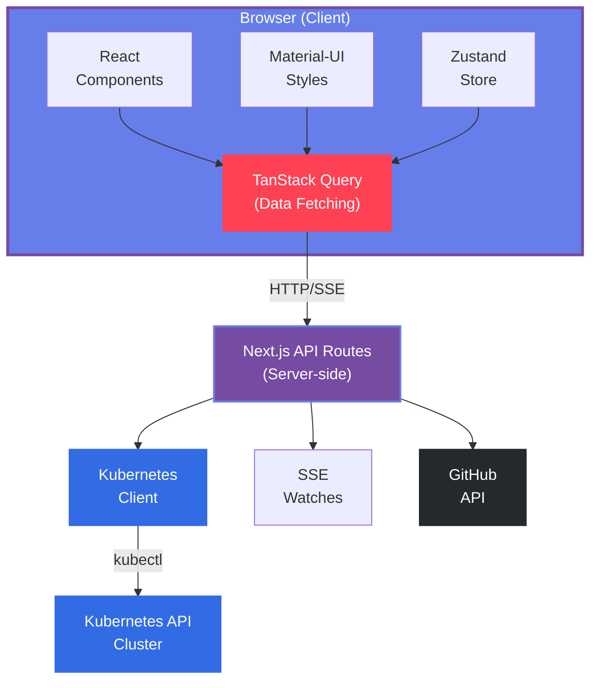

## Welcome, Developer!

This section contains comprehensive technical documentation for developers who want to:
- Understand the architecture
- Contribute to the project
- Extend functionality
- Debug issues
- Deploy Orphelix

## Technology Stack

<CardGroup cols={2}>
  <Card title="Frontend" icon="window">
    - **Next.js 15** - React framework with App Router
    - **React 19** - UI library
    - **Material-UI v7** - Component library
    - **TypeScript 5.7** - Type safety
  </Card>
  <Card title="State Management" icon="database">
    - **TanStack Query v5** - Data fetching & caching
    - **Zustand** - Global state (theme, mode, namespace)
    - **Context API** - Search state management
  </Card>
  <Card title="Backend" icon="server">
    - **Next.js API Routes** - Serverless functions
    - **@kubernetes/client-node** - K8s API client
    - **Server-Sent Events** - Real-time updates
  </Card>
  <Card title="Testing" icon="vial">
    - **Vitest** - Unit testing framework
    - **Playwright** - E2E testing
    - **React Testing Library** - Component testing
  </Card>
</CardGroup>

## Architecture Overview

Orphelix follows a modern, scalable architecture:



## Key Design Patterns

### 1. API Route Architecture

All Kubernetes operations are server-side to prevent credentials exposure:

```typescript
// app/api/deployments/route.ts
export async function GET(request: Request) {
  const kc = getKubeConfig()
  const k8sApi = kc.makeApiClient(AppsV1Api)

  const { data } = await k8sApi.listNamespacedDeployment({
    namespace: 'default'
  })

  return NextResponse.json(deployments)
}
```

### 2. TanStack Query Hooks

Consistent data fetching pattern with caching:

```typescript
export function useDeployments() {
  return useQuery({
    queryKey: ['deployments', namespace],
    queryFn: () => fetch('/api/deployments').then(r => r.json()),
    refetchInterval: 30000, // Auto-refresh every 30s
  })
}
```

### 3. Real-time Updates with SSE

Server-Sent Events for live cluster updates:

```typescript
// Server
const stream = new ReadableStream({
  start(controller) {
    watcher.on('ADDED', (obj) => {
      controller.enqueue(`data: ${JSON.stringify(obj)}\n\n`)
    })
  }
})

// Client
useEffect(() => {
  const eventSource = new EventSource('/api/realtime')
  eventSource.onmessage = (event) => {
    queryClient.invalidateQueries(['deployments'])
  }
}, [])
```

### 4. Component Structure

Consistent component organization:

```
app/
  components/
    common/          # Reusable components
    layout/          # Layout components
    [resource]/      # Resource-specific components
  [resource]/        # Pages
    page.tsx         # List view
    [name]/
      page.tsx       # Detail view
```

## Getting Started

<Steps>
  <Step title="Set up your environment">
    See [Getting Started](/developer/getting-started) for setup instructions
  </Step>

  <Step title="Understand the architecture">
    Read [Architecture](/developer/architecture) for detailed system design
  </Step>

  <Step title="Review the tech stack">
    Check [Tech Stack](/developer/tech-stack) for technology decisions
  </Step>

  <Step title="Run tests">
    Follow [Testing Guide](/developer/testing) to run and write tests
  </Step>

  <Step title="Start contributing">
    See [Contributing](/developer/contributing) for contribution guidelines
  </Step>
</Steps>

## Quick Links

<CardGroup cols={3}>
  <Card title="API Reference" icon="code" href="/developer/api/introduction">
    REST API documentation
  </Card>
  <Card title="Testing" icon="vial" href="/developer/testing">
    Testing strategy and guides
  </Card>
  <Card title="Contributing" icon="code-pull-request" href="/developer/contributing">
    How to contribute code
  </Card>
</CardGroup>

## Development Principles

<AccordionGroup>
  <Accordion icon="shield" title="Security First">
    - Never expose cluster credentials to browser
    - All K8s operations are server-side
    - Secrets values are never displayed
    - GitHub App tokens in HTTP-only cookies
  </Accordion>

  <Accordion icon="gauge-high" title="Performance">
    - Aggressive caching with TanStack Query
    - Server-Side Rendering (SSR) for initial load
    - Code splitting with Next.js dynamic imports
    - Optimistic UI updates
  </Accordion>

  <Accordion icon="check" title="Type Safety">
    - Strict TypeScript configuration
    - Full type coverage for K8s resources
    - Type-safe API routes
    - No `any` types allowed
  </Accordion>

  <Accordion icon="flask" title="Testability">
    - 214+ unit tests with Vitest
    - 93+ E2E tests with Playwright
    - Mock data for demo mode
    - Test coverage reporting
  </Accordion>
</AccordionGroup>

## Repository Structure

```
orphelix/
├── app/                    # Next.js app directory
│   ├── api/               # API routes
│   ├── components/        # React components
│   └── [resources]/       # Page routes
├── lib/                   # Utilities & hooks
│   ├── hooks/            # TanStack Query hooks
│   ├── utils/            # Helper functions
│   └── store/            # Zustand store
├── types/                 # TypeScript definitions
├── __tests__/            # Unit tests
├── e2e/                  # E2E tests
└── docs/                 # Documentation
```

## Next Steps

Choose your path:

<CardGroup cols={2}>
  <Card title="I want to contribute code" icon="code" href="/developer/contributing">
    Read the contributing guide
  </Card>
  <Card title="I want to understand the architecture" icon="sitemap" href="/developer/architecture">
    Explore the architecture
  </Card>
  <Card title="I want to add tests" icon="vial" href="/developer/testing">
    Learn about testing
  </Card>
  <Card title="I want to deploy Orphelix" icon="rocket" href="/developer/deployment">
    See deployment options
  </Card>
</CardGroup>
