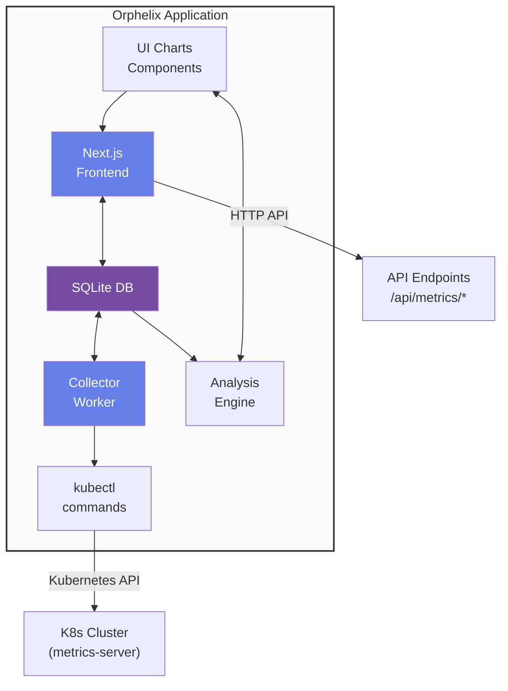

# Resource Usage History & Optimization Recommendations

<Info>
**Status:** Planned
**Priority:** High
**Estimated Effort:** 3-4 weeks
**Last Updated:** 2025-11-26
</Info>

## Table of Contents

1. [Overview & Motivation](#overview--motivation)
2. [Current State](#current-state)
3. [Data Sources](#data-sources)
4. [Database Schema](#database-schema)
5. [Architecture](#architecture)
6. [Implementation Phases](#implementation-phases)
7. [API Specification](#api-specification)
8. [UI/UX Design](#uiux-design)
9. [Recommendation Algorithms](#recommendation-algorithms)
10. [Configuration & Settings](#configuration--settings)
11. [Testing Strategy](#testing-strategy)
12. [Performance Considerations](#performance-considerations)
13. [Future Enhancements](#future-enhancements)

---

## Overview & Motivation

### Problem Statement

Currently, Orphelix shows **real-time resource usage** for deployments (CPU/Memory metrics from `kubectl top`), but:

- ❌ No historical data - only current snapshot
- ❌ No way to analyze trends over time
- ❌ No automated recommendations for resource optimization
- ❌ Users must manually compare usage vs limits and guess optimal values
- ❌ Over-provisioning wastes money, under-provisioning causes performance issues

### Solution

Build a **Resource Usage History & Optimization System** that:

- ✅ Collects metrics every 5-10 minutes and stores in SQLite
- ✅ Analyzes historical data (7/14/30 days)
- ✅ Detects over-provisioning, under-provisioning, patterns
- ✅ Provides actionable recommendations with confidence scores
- ✅ Shows historical trends in charts
- ✅ Estimates cost savings
- ✅ Auto-generates optimized YAML manifests

### Benefits

1. **Cost Optimization** - Reduce wasted resources (typical savings: 20-40%)
2. **Performance Improvement** - Detect under-provisioned apps before they crash
3. **Data-Driven Decisions** - Stop guessing, use real historical data
4. **Early Warning System** - Detect degrading performance trends
5. **Self-Service** - No need for Prometheus, Grafana, or other external tools
6. **Privacy** - All data stored locally in SQLite

---

## Current State

### What We Have

**✅ Metrics API Endpoint**
- File: `app/app/api/metrics/pods/route.ts`
- Fetches real-time metrics from `kubectl top pods`
- Returns: CPU/Memory (current, requests, limits) per pod/container
- Supports both demo mode and real cluster

**✅ Resource Usage Chart Component**
- File: `app/app/components/metrics/resource-usage-chart.tsx`
- Displays current CPU/Memory usage with progress bars
- Shows usage percentage vs limits
- Aggregates metrics across all pods in deployment

**✅ SQLite Database**
- File: `app/lib/db/database.ts`
- Already configured with better-sqlite3
- Used for user settings, GitHub settings, etc.

**✅ Background Workers**
- Notification worker already running via pm2
- Infrastructure ready for additional workers

### What's Missing

- ❌ Historical metrics collection
- ❌ Database tables for metrics history
- ❌ Background collector worker
- ❌ Analysis engine for recommendations
- ❌ Historical trend charts
- ❌ Recommendation UI components

---

## Data Sources

### 1. Core Metrics (Required - High Value)

#### CPU & Memory Usage
**Source:** `kubectl top pods -n <namespace> -l <label-selector>`
```bash
NAME                          CPU(cores)   MEMORY(bytes)
my-app-6d8f9c7b4-abc12        245m         412Mi
my-app-6d8f9c7b4-def34        198m         389Mi
```

**Data Points:**
- `cpu_current_millicores` - Current CPU usage in millicores
- `memory_current_bytes` - Current memory usage in bytes
- `pod_count` - Number of running pods

**Collection Frequency:** Every 5 minutes (configurable)

---

#### Resource Requests & Limits
**Source:** `kubectl get deployment <name> -n <namespace> -o json`
```json
{
  "spec": {
    "template": {
      "spec": {
        "containers": [{
          "resources": {
            "requests": { "cpu": "100m", "memory": "128Mi" },
            "limits": { "cpu": "500m", "memory": "512Mi" }
          }
        }]
      }
    }
  }
}
```

**Data Points:**
- `cpu_requested_millicores`
- `cpu_limit_millicores`
- `memory_requested_bytes`
- `memory_limit_bytes`

**Collection Frequency:** Every 5 minutes (may change less often, but we track it)

---

#### Container Restarts & Reasons
**Source:** `kubectl get pods -n <namespace> -l <label-selector> -o json`
```json
{
  "status": {
    "containerStatuses": [{
      "name": "app",
      "restartCount": 5,
      "lastState": {
        "terminated": {
          "reason": "OOMKilled",
          "exitCode": 137
        }
      }
    }]
  }
}
```

**Data Points:**
- `total_restarts` - Sum of restarts across all pods
- `oom_kills_count` - Count of OOMKilled events
- `crash_count` - Count of Error/CrashLoopBackOff

**Value:**
- High OOMKills → Memory limit too low
- High crashes → Application issue or resource starvation

**Collection Frequency:** Every 5 minutes

---

#### Quality of Service (QoS) Class
**Source:** `kubectl get pods -o json → status.qosClass`

**Possible Values:**
- `Guaranteed` - Requests = Limits (best, won't be evicted easily)
- `Burstable` - Requests < Limits (medium priority)
- `BestEffort` - No requests/limits (first to be evicted)

**Value:**
- BestEffort pods are dangerous in production
- Recommend moving to Burstable or Guaranteed

**Collection Frequency:** Every collection cycle (rarely changes)

---

### 2. Contextual Data (Recommended - Medium Value)

#### HPA (Horizontal Pod Autoscaler) Status
**Source:** `kubectl get hpa -n <namespace> -o json`
```json
{
  "spec": {
    "minReplicas": 2,
    "maxReplicas": 10,
    "targetCPUUtilizationPercentage": 70
  },
  "status": {
    "currentReplicas": 8,
    "desiredReplicas": 10,
    "currentMetrics": [...]
  }
}
```

**Data Points:**
- `hpa_enabled` - Boolean
- `current_replicas`
- `desired_replicas`
- `max_replicas`
- `is_at_max` - Boolean (desired == max)

**Value:**
- If HPA constantly at max → Need higher per-pod resources OR increase max replicas
- If HPA rarely scales up → Over-provisioned

**Collection Frequency:** Every 5 minutes

---

#### Pod Events (Evictions, Scheduling Issues)
**Source:** `kubectl get events -n <namespace> --field-selector involvedObject.name=<pod-name>`
```
REASON        MESSAGE
Evicted       The node was low on resource: memory
FailedScheduling  0/3 nodes are available: Insufficient cpu
```

**Data Points:**
- `eviction_count_30d` - Count of evictions in last 30 days
- `scheduling_failure_count` - Failed scheduling attempts
- `last_eviction_reason` - Why pod was evicted

**Value:**
- Evictions → Resources too low for node pressure scenarios
- FailedScheduling → Requests too high for cluster capacity

**Collection Frequency:** Every 15 minutes (events are noisy)

---

#### Deployment Age & Stability
**Source:** `kubectl get deployment -o json → metadata.creationTimestamp`

**Data Points:**
- `deployment_age_days` - How long deployment has existed
- `data_points_collected` - Count of metrics snapshots

**Value:**
- Don't recommend optimizations for deployments < 7 days old (insufficient data)
- More data points = higher confidence in recommendations

**Collection Frequency:** Calculated, not stored

---

#### Node Capacity Context
**Source:** `kubectl top nodes` + `kubectl get nodes -o json`
```
NAME          CPU(cores)   CPU%   MEMORY(bytes)   MEMORY%
node-1        2500m        62%    8Gi             75%
node-2        1800m        45%    6Gi             56%
```

**Data Points:**
- `cluster_total_cpu_millicores`
- `cluster_total_memory_bytes`
- `cluster_available_cpu_millicores`
- `cluster_available_memory_bytes`

**Value:**
- Don't recommend increasing resources if cluster has no capacity
- Show "deployment uses X% of total cluster resources"

**Collection Frequency:** Every 15 minutes

---

### 3. Advanced Data (Optional - Nice to Have)

#### CPU Throttling
**Source:** cAdvisor or Prometheus metrics (NOT available via kubectl)
```
container_cpu_cfs_throttled_seconds_total
```

**Value:**
- High throttling → CPU limit too low, app is slowing down
- **Note:** Requires Prometheus integration (future enhancement)

**Collection Frequency:** N/A (future)

---

#### Network & Disk I/O
**Source:** Metrics-server with extended metrics (rarely available)

**Value:**
- Determine if app is CPU-bound, Memory-bound, or I/O-bound
- I/O-bound apps won't benefit from more CPU/Memory

**Collection Frequency:** N/A (future)

---

#### Application Logs (Error Patterns)
**Source:** `kubectl logs` + parsing
```
OutOfMemoryError
java.lang.OutOfMemoryError: Java heap space
Connection timeout after 30s
```

**Value:**
- Correlate errors with resource metrics
- Detect memory leaks (gradual memory increase + OOM errors)

**Collection Frequency:** N/A (too expensive, future enhancement)

---

## Database Schema

### New Tables

#### `resource_metrics_history`
Stores time-series metrics snapshots for all deployments.

```sql
CREATE TABLE IF NOT EXISTS resource_metrics_history (
  id INTEGER PRIMARY KEY AUTOINCREMENT,
  deployment_name TEXT NOT NULL,
  namespace TEXT NOT NULL,
  timestamp DATETIME DEFAULT CURRENT_TIMESTAMP,

  -- CPU metrics
  cpu_current_millicores INTEGER NOT NULL,        -- Actual usage
  cpu_requested_millicores INTEGER NOT NULL,      -- Requested
  cpu_limit_millicores INTEGER NOT NULL,          -- Limit

  -- Memory metrics
  memory_current_bytes INTEGER NOT NULL,          -- Actual usage
  memory_requested_bytes INTEGER NOT NULL,        -- Requested
  memory_limit_bytes INTEGER NOT NULL,            -- Limit

  -- Pod metrics
  pod_count INTEGER NOT NULL,                     -- Number of running pods
  total_restarts INTEGER NOT NULL DEFAULT 0,      -- Sum of all container restarts
  oom_kills_count INTEGER NOT NULL DEFAULT 0,     -- OOMKilled events count

  -- HPA metrics (if applicable)
  hpa_enabled INTEGER NOT NULL DEFAULT 0,         -- Boolean
  hpa_current_replicas INTEGER,
  hpa_desired_replicas INTEGER,
  hpa_max_replicas INTEGER,

  -- QoS
  qos_class TEXT,                                 -- Guaranteed, Burstable, BestEffort

  -- Context
  eviction_count_30d INTEGER DEFAULT 0,          -- Evictions in last 30 days

  UNIQUE(deployment_name, namespace, timestamp)
);

-- Indexes for fast queries
CREATE INDEX IF NOT EXISTS idx_metrics_deployment
  ON resource_metrics_history(deployment_name, namespace, timestamp DESC);

CREATE INDEX IF NOT EXISTS idx_metrics_timestamp
  ON resource_metrics_history(timestamp DESC);
```

**Estimated Size:**
- 1 deployment, 5-minute intervals, 30 days = 8,640 rows
- 100 deployments = 864,000 rows (~200 bytes/row = ~165 MB)
- With 7-day retention: ~40 MB per 100 deployments

---

#### `resource_monitoring_settings`
Configuration for metrics collection.

```sql
CREATE TABLE IF NOT EXISTS resource_monitoring_settings (
  id INTEGER PRIMARY KEY CHECK (id = 1),          -- Singleton
  enabled INTEGER NOT NULL DEFAULT 1,             -- Boolean
  collection_interval_minutes INTEGER NOT NULL DEFAULT 5,
  retention_days INTEGER NOT NULL DEFAULT 30,

  -- Filters
  monitor_all_deployments INTEGER NOT NULL DEFAULT 1,  -- Boolean
  excluded_namespaces TEXT,                       -- JSON array of namespaces to exclude

  -- Thresholds for recommendations
  over_provisioning_threshold REAL NOT NULL DEFAULT 0.3,   -- 30% usage
  under_provisioning_threshold REAL NOT NULL DEFAULT 0.85, -- 85% usage
  min_data_points_required INTEGER NOT NULL DEFAULT 100,   -- ~8 hours of data

  created_at DATETIME DEFAULT CURRENT_TIMESTAMP,
  updated_at DATETIME DEFAULT CURRENT_TIMESTAMP
);

-- Initialize defaults
INSERT OR IGNORE INTO resource_monitoring_settings (id) VALUES (1);
```

---

#### `resource_recommendations_cache`
Cache computed recommendations to avoid re-analyzing on every request.

```sql
CREATE TABLE IF NOT EXISTS resource_recommendations_cache (
  id INTEGER PRIMARY KEY AUTOINCREMENT,
  deployment_name TEXT NOT NULL,
  namespace TEXT NOT NULL,

  -- Recommendation data (JSON)
  recommendations TEXT NOT NULL,                  -- JSON array of recommendations
  confidence_score REAL NOT NULL,                 -- 0.0 to 1.0

  -- Stats
  avg_cpu_usage_millicores INTEGER,
  avg_memory_usage_bytes INTEGER,
  p95_cpu_usage_millicores INTEGER,
  p95_memory_usage_bytes INTEGER,

  -- Metadata
  data_points_analyzed INTEGER NOT NULL,
  analysis_period_days INTEGER NOT NULL,
  generated_at DATETIME DEFAULT CURRENT_TIMESTAMP,
  expires_at DATETIME NOT NULL,                   -- Re-analyze after expiry

  UNIQUE(deployment_name, namespace)
);

CREATE INDEX IF NOT EXISTS idx_recommendations_expiry
  ON resource_recommendations_cache(expires_at);
```

---

### Modified Tables

#### `user_settings` (add monitoring toggle)
```sql
ALTER TABLE user_settings
  ADD COLUMN resource_monitoring_enabled INTEGER NOT NULL DEFAULT 1;
```

---

## Architecture

### System Components



### Component Details

#### 1. **Metrics Collector Worker** (`lib/metrics/collector.js`)

**Responsibilities:**
- Runs as pm2 background process (like notification worker)
- Every N minutes (default: 5):
  1. Read settings from `resource_monitoring_settings`
  2. Fetch list of all deployments (or filtered list)
  3. For each deployment:
     - Fetch metrics from `kubectl top pods`
     - Fetch pod specs for requests/limits
     - Fetch events for OOMKills/evictions
     - Fetch HPA status if applicable
  4. Write snapshot to `resource_metrics_history`
  5. Cleanup old data beyond retention period

**Lifecycle:**
- Start: `orphelix start` (automatically)
- Stop: `orphelix stop`
- Logs: `orphelix logs --name orphelix-metrics-collector`

**Error Handling:**
- If kubectl fails → log error, skip that deployment, continue
- If database write fails → log error, retry once
- Never crash the whole worker

---

#### 2. **Analysis Engine** (`lib/metrics/analyzer.ts`)

**Responsibilities:**
- On-demand analysis (not continuous)
- Triggered by API request: `GET /api/metrics/recommendations?deployment=X`
- Steps:
  1. Query `resource_metrics_history` for last N days
  2. Calculate statistics (min, max, avg, p50, p95, p99, stddev)
  3. Run detection algorithms (see [Recommendation Algorithms](#recommendation-algorithms))
  4. Generate recommendations with confidence scores
  5. Cache results in `resource_recommendations_cache` (TTL: 1 hour)
  6. Return JSON

**Caching:**
- Cache valid for 1 hour
- Invalidate on new deployment or settings change

---

#### 3. **API Endpoints**

| Endpoint | Method | Description |
|----------|--------|-------------|
| `/api/metrics/history` | GET | Get historical metrics for deployment |
| `/api/metrics/recommendations` | GET | Get optimization recommendations |
| `/api/metrics/stats` | GET | Get statistical summary (min/max/avg/p95) |
| `/api/metrics/collector/status` | GET | Check collector worker status |
| `/api/metrics/collector/trigger` | POST | Manually trigger collection |
| `/api/metrics/settings` | GET/POST | Get/update monitoring settings |

---

#### 4. **UI Components**

**New Components:**
- `ResourceHistoryChart` - Line chart showing CPU/Memory over time
- `ResourceOptimizationPanel` - Main panel with recommendations
- `RecommendationCard` - Individual recommendation with badge
- `ResourceStatsGrid` - Stats grid (min/max/avg/p95)
- `OptimizedYamlPreview` - Preview of optimized manifest
- `ResourceMonitoringSettings` - Settings panel

**Modified Components:**
- `ResourceUsageChart` - Add link to history, add mini sparkline

---

## Implementation Phases

### Phase 1: Database & Collector (MVP)
**Goal:** Start collecting data
**Duration:** 1 week

**Tasks:**
1. ✅ Create database schema (`resource_metrics_history`, `resource_monitoring_settings`)
2. ✅ Create migration script
3. ✅ Build metrics collector worker (`lib/metrics/collector.js`)
4. ✅ Integrate with pm2 (start/stop with `orphelix start/stop`)
5. ✅ Create `/api/metrics/settings` endpoint
6. ✅ Add monitoring settings UI in Settings page
7. ✅ Test data collection for 24 hours

**Deliverables:**
- Working collector storing metrics every 5 minutes
- Settings UI to enable/disable, configure interval
- CLI integration (`orphelix-metrics-collector` process)

---

### Phase 2: Historical Analysis & Recommendations
**Goal:** Generate actionable recommendations
**Duration:** 1 week

**Tasks:**
1. ✅ Build analysis engine (`lib/metrics/analyzer.ts`)
2. ✅ Implement detection algorithms (over/under-provisioning, patterns)
3. ✅ Create `/api/metrics/recommendations` endpoint
4. ✅ Create `/api/metrics/stats` endpoint
5. ✅ Build recommendation caching system
6. ✅ Write unit tests for algorithms

**Deliverables:**
- Working recommendation API
- Tested algorithms with edge cases
- Cached results for performance

---

### Phase 3: UI Integration
**Goal:** Show history and recommendations in UI
**Duration:** 1 week

**Tasks:**
1. ✅ Create `ResourceHistoryChart` component (chart.js or recharts)
2. ✅ Create `ResourceOptimizationPanel` component
3. ✅ Create `RecommendationCard` component
4. ✅ Integrate into deployment detail page
5. ✅ Add "View History" link to `ResourceUsageChart`
6. ✅ Build optimized YAML preview
7. ✅ Add "Apply Recommendations" button → opens YAML editor with pre-filled values

**Deliverables:**
- Beautiful charts showing 7/30 day trends
- List of recommendations with severity badges
- One-click apply to YAML editor

---

### Phase 4: Advanced Features
**Goal:** Polish and enhancements
**Duration:** 1 week

**Tasks:**
1. ✅ Pattern detection (daily/weekly cycles)
2. ✅ Cost estimation ($/month savings)
3. ✅ Export recommendations as PDF/JSON
4. ✅ Batch recommendations (all deployments)
5. ✅ Recommendation history (track applied recommendations)
6. ✅ Alerts (notify when recommendation confidence > 90%)
7. ✅ Integration with notification worker

**Deliverables:**
- Advanced analytics
- Cost savings dashboard
- Notification when critical recommendations appear

---

## API Specification

### GET `/api/metrics/history`

**Query Parameters:**
- `deployment` (required) - Deployment name
- `namespace` (optional) - Namespace (default: selected namespace)
- `days` (optional) - Number of days (default: 7, max: 90)
- `granularity` (optional) - `5min`, `15min`, `1h`, `1d` (default: auto based on days)

**Response:**
```json
{
  "deployment": "my-app",
  "namespace": "production",
  "period": {
    "start": "2025-11-01T00:00:00Z",
    "end": "2025-11-26T00:00:00Z",
    "days": 7,
    "dataPoints": 2016
  },
  "metrics": [
    {
      "timestamp": "2025-11-26T10:00:00Z",
      "cpu": {
        "current": 245,
        "requested": 100,
        "limit": 500
      },
      "memory": {
        "current": 412000000,
        "requested": 134217728,
        "limit": 536870912
      },
      "podCount": 3,
      "restarts": 0,
      "oomKills": 0
    }
    // ... more data points
  ]
}
```

---

### GET `/api/metrics/recommendations`

**Query Parameters:**
- `deployment` (required)
- `namespace` (optional)
- `days` (optional) - Analysis period (default: 7)

**Response:**
```json
{
  "deployment": "my-app",
  "namespace": "production",
  "analysis": {
    "period": "7 days",
    "dataPoints": 2016,
    "confidenceScore": 0.87
  },
  "recommendations": [
    {
      "id": "cpu-over-provisioned",
      "type": "over_provisioning",
      "resource": "cpu",
      "severity": "medium",
      "title": "CPU limit is over-provisioned",
      "description": "Average CPU usage is 49% of limit (245m / 500m). You can reduce the limit to save resources.",
      "currentValue": "500m",
      "recommendedValue": "300m",
      "savings": {
        "percentage": 40,
        "millicores": 200
      },
      "confidence": 0.92,
      "reasoning": [
        "Average usage: 245m (49% of limit)",
        "P95 usage: 280m (56% of limit)",
        "Max usage: 310m (62% of limit)",
        "Stable pattern over 7 days"
      ]
    },
    {
      "id": "memory-adequate",
      "type": "healthy",
      "resource": "memory",
      "severity": "success",
      "title": "Memory configuration is healthy",
      "description": "Memory usage is within optimal range (70-85% of limit).",
      "currentValue": "512Mi",
      "recommendedValue": "512Mi",
      "confidence": 0.85
    },
    {
      "id": "oom-kills-detected",
      "type": "critical",
      "resource": "memory",
      "severity": "error",
      "title": "OOMKills detected - memory limit too low",
      "description": "3 OOMKilled events in last 7 days. Containers are being killed due to memory limits.",
      "currentValue": "512Mi",
      "recommendedValue": "768Mi",
      "confidence": 0.95,
      "reasoning": [
        "3 OOMKilled events detected",
        "Memory usage peaks at 490Mi (95% of limit)",
        "Immediate action recommended"
      ]
    }
  ],
  "stats": {
    "cpu": {
      "min": 120,
      "max": 310,
      "avg": 245,
      "p50": 240,
      "p95": 280,
      "p99": 300,
      "stddev": 35
    },
    "memory": {
      "min": 350000000,
      "max": 490000000,
      "avg": 412000000,
      "p50": 410000000,
      "p95": 470000000,
      "p99": 485000000,
      "stddev": 25000000
    }
  },
  "optimizedManifest": {
    "cpu": {
      "request": "200m",
      "limit": "300m"
    },
    "memory": {
      "request": "400Mi",
      "limit": "768Mi"
    }
  }
}
```

---

### GET `/api/metrics/stats`

**Query Parameters:**
- `deployment` (required)
- `namespace` (optional)
- `days` (optional)

**Response:**
```json
{
  "deployment": "my-app",
  "namespace": "production",
  "period": "7 days",
  "cpu": {
    "current": 245,
    "min": 120,
    "max": 310,
    "avg": 245,
    "p50": 240,
    "p95": 280,
    "p99": 300,
    "stddev": 35,
    "requested": 100,
    "limit": 500,
    "utilizationPercent": 49
  },
  "memory": {
    "current": 412000000,
    "min": 350000000,
    "max": 490000000,
    "avg": 412000000,
    "p50": 410000000,
    "p95": 470000000,
    "p99": 485000000,
    "stddev": 25000000,
    "requested": 134217728,
    "limit": 536870912,
    "utilizationPercent": 77
  },
  "pods": {
    "avgCount": 3,
    "minCount": 3,
    "maxCount": 3
  },
  "restarts": {
    "total": 5,
    "oomKills": 3,
    "crashes": 2
  }
}
```

---

## UI/UX Design

### Deployment Detail Page - New Section

**Location:** Below existing `ResourceUsageChart` on `/deployments/[name]`

**Layout:**
```
┌─────────────────────────────────────────────────────────────┐
│  Resource Usage (Current)                                    │
│  [Existing ResourceUsageChart component]                     │
└─────────────────────────────────────────────────────────────┘

┌─────────────────────────────────────────────────────────────┐
│  📊 Resource Usage History (7 days)              [30 days ▼]│
│                                                               │
│  CPU Usage Trend                                             │
│  ┌───────────────────────────────────────────────────────┐  │
│  │  500m ┤                                                │  │
│  │       │     ╱╲    ╱╲                                  │  │
│  │  300m ┤────╱──╲──╱──╲─────────────────── Limit       │  │
│  │       │                                                │  │
│  │  200m ┤─────────────────────────────── Avg Usage      │  │
│  │       │                                                │  │
│  │  100m ┤────────────────────────────── Requested       │  │
│  │    0m └────────────────────────────────────────────   │  │
│  │         Mon   Tue   Wed   Thu   Fri   Sat   Sun      │  │
│  └───────────────────────────────────────────────────────┘  │
│                                                               │
│  Memory Usage Trend                                          │
│  [Similar chart for memory]                                  │
│                                                               │
│  Stats: Avg 245m | P95 280m | Max 310m | σ 35m              │
└─────────────────────────────────────────────────────────────┘

┌─────────────────────────────────────────────────────────────┐
│  💡 Optimization Recommendations                             │
│                                                               │
│  ┌─────────────────────────────────────────────────────┐    │
│  │ ⚠️  CPU limit is over-provisioned         [MEDIUM]  │    │
│  │                                                      │    │
│  │ Average CPU usage is 49% of limit (245m / 500m).    │    │
│  │ You can reduce the limit to save resources.         │    │
│  │                                                      │    │
│  │ Current:  500m  →  Recommended: 300m                │    │
│  │ Savings:  40% reduction (200 millicores)            │    │
│  │ Confidence: 92%  |  Based on 7 days of data         │    │
│  │                                                      │    │
│  │ [View Details]  [Apply to YAML]                     │    │
│  └─────────────────────────────────────────────────────┘    │
│                                                               │
│  ┌─────────────────────────────────────────────────────┐    │
│  │ 🚨 OOMKills detected - memory limit too low  [CRITICAL] │
│  │                                                      │    │
│  │ 3 OOMKilled events in last 7 days. Containers are   │    │
│  │ being killed due to memory limits.                  │    │
│  │                                                      │    │
│  │ Current:  512Mi  →  Recommended: 768Mi              │    │
│  │ Increase: +256Mi (+50%)                             │    │
│  │ Confidence: 95%  |  IMMEDIATE ACTION RECOMMENDED    │    │
│  │                                                      │    │
│  │ [View Details]  [Apply to YAML]                     │    │
│  └─────────────────────────────────────────────────────┘    │
│                                                               │
│  ┌─────────────────────────────────────────────────────┐    │
│  │ ✅ Memory configuration is healthy         [SUCCESS]│    │
│  │                                                      │    │
│  │ Memory usage is within optimal range (70-85%).      │    │
│  │ No changes recommended.                             │    │
│  └─────────────────────────────────────────────────────┘    │
│                                                               │
│  [Apply All Recommendations]  [Export Report]               │
└─────────────────────────────────────────────────────────────┘
```

---

### Settings Page - New Section

**Location:** Settings → Cluster Configuration → Resource Monitoring

```
┌─────────────────────────────────────────────────────────────┐
│  Resource Monitoring & Optimization                          │
│                                                               │
│  Automatically collect resource metrics and generate         │
│  optimization recommendations for your deployments.          │
│                                                               │
│  ┌─────────────────────────────────────────────────────┐    │
│  │ ☑️  Enable Resource Metrics Collection              │    │
│  │                                                      │    │
│  │ Collect CPU and memory usage data every 5 minutes   │    │
│  └─────────────────────────────────────────────────────┘    │
│                                                               │
│  Collection Interval:  [5 min ▼] [10 min] [15 min]          │
│  Data Retention:       [7 days] [14 days] [30 days ▼]       │
│                                                               │
│  Monitor:  ⦿ All deployments                                 │
│            ○ Specific namespaces only                        │
│                                                               │
│  Recommendation Thresholds:                                  │
│    Over-provisioning:   [30%] or less usage                  │
│    Under-provisioning:  [85%] or more usage                  │
│    Min data points:     [100] (≈8 hours)                     │
│                                                               │
│  💾 Database Usage: 45 MB (23,450 metrics stored)            │
│      Oldest data: 2025-10-27 (30 days ago)                   │
│                                                               │
│  [Clean Old Data]  [Export Metrics]                          │
└─────────────────────────────────────────────────────────────┘
```

---

## Recommendation Algorithms

### Algorithm 1: Over-Provisioning Detection

**Goal:** Detect when resources are wasted (limit much higher than actual usage)

**Logic:**
```typescript
function detectOverProvisioning(metrics: MetricsHistory[], config: ThresholdConfig) {
  const threshold = config.over_provisioning_threshold // default: 0.3 (30%)

  // Calculate average and P95 usage
  const avgUsage = mean(metrics.map(m => m.cpu_current_millicores))
  const p95Usage = percentile(metrics.map(m => m.cpu_current_millicores), 95)
  const limit = metrics[0].cpu_limit_millicores

  const avgUtilization = avgUsage / limit
  const p95Utilization = p95Usage / limit

  // Over-provisioned if BOTH avg and P95 are below threshold
  if (avgUtilization < threshold && p95Utilization < (threshold + 0.1)) {
    return {
      detected: true,
      severity: avgUtilization < 0.2 ? 'high' : 'medium',
      currentLimit: limit,
      recommendedLimit: Math.ceil(p95Usage * 1.15), // P95 + 15% headroom
      savings: {
        millicores: limit - recommendedLimit,
        percentage: ((limit - recommendedLimit) / limit) * 100
      },
      confidence: calculateConfidence(metrics.length, stddev(metrics))
    }
  }

  return { detected: false }
}
```

**Confidence Calculation:**
- More data points = higher confidence
- Lower standard deviation = higher confidence
- Minimum 100 data points for any recommendation

```typescript
function calculateConfidence(dataPoints: number, stddev: number, mean: number): number {
  // Base confidence from data points
  let confidence = Math.min(dataPoints / 200, 1.0) * 0.5 // max 0.5 from data points

  // Stability bonus (low coefficient of variation)
  const cv = stddev / mean // Coefficient of Variation
  const stabilityBonus = Math.max(0, (1 - cv) * 0.5) // max 0.5 from stability

  confidence += stabilityBonus

  return Math.min(confidence, 1.0)
}
```

---

### Algorithm 2: Under-Provisioning Detection

**Goal:** Detect when app is hitting limits and needs more resources

**Logic:**
```typescript
function detectUnderProvisioning(metrics: MetricsHistory[], events: EventHistory[]) {
  const threshold = 0.85 // 85% utilization

  const avgUsage = mean(metrics.map(m => m.cpu_current_millicores))
  const p95Usage = percentile(metrics.map(m => m.cpu_current_millicores), 95)
  const limit = metrics[0].cpu_limit_millicores

  const avgUtilization = avgUsage / limit
  const p95Utilization = p95Usage / limit

  // Critical: OOMKills or frequent restarts
  const oomKills = sum(metrics.map(m => m.oom_kills_count))
  const totalRestarts = sum(metrics.map(m => m.total_restarts))

  if (oomKills > 0) {
    return {
      detected: true,
      severity: 'critical',
      type: 'oom_kills',
      currentLimit: limit,
      recommendedLimit: Math.ceil(limit * 1.5), // +50% for OOMKills
      confidence: 0.95,
      reasoning: `${oomKills} OOMKilled events detected. Immediate action required.`
    }
  }

  // High: Consistently hitting limit
  if (p95Utilization > threshold) {
    return {
      detected: true,
      severity: 'high',
      type: 'high_utilization',
      currentLimit: limit,
      recommendedLimit: Math.ceil(p95Usage * 1.25), // P95 + 25% headroom
      confidence: calculateConfidence(metrics.length, stddev(metrics)),
      reasoning: `P95 usage is ${(p95Utilization * 100).toFixed(1)}% of limit`
    }
  }

  return { detected: false }
}
```

---

### Algorithm 3: Requests vs Reality Gap

**Goal:** Detect when requested resources don't match actual usage

**Logic:**
```typescript
function detectRequestsGap(metrics: MetricsHistory[]) {
  const avgUsage = mean(metrics.map(m => m.cpu_current_millicores))
  const requested = metrics[0].cpu_requested_millicores

  const ratio = avgUsage / requested

  // Requested too high (wasting scheduler resources)
  if (ratio < 0.5 && avgUsage > 100) { // Don't adjust very small requests
    return {
      detected: true,
      type: 'requests_too_high',
      severity: 'low',
      currentRequests: requested,
      recommendedRequests: Math.ceil(avgUsage * 1.1), // avg + 10%
      reasoning: 'Requested CPU is much higher than actual usage'
    }
  }

  // Requested too low (risk of pod not being scheduled on busy nodes)
  if (ratio > 2.0) {
    return {
      detected: true,
      type: 'requests_too_low',
      severity: 'medium',
      currentRequests: requested,
      recommendedRequests: Math.ceil(avgUsage * 0.9), // avg - 10%
      reasoning: 'Actual usage is much higher than requested'
    }
  }

  return { detected: false }
}
```

---

### Algorithm 4: Pattern Detection (Daily/Weekly Cycles)

**Goal:** Detect predictable patterns (e.g., high usage during business hours)

**Logic:**
```typescript
function detectPatterns(metrics: MetricsHistory[]) {
  // Group by hour of day
  const byHour = groupBy(metrics, m => new Date(m.timestamp).getHours())

  // Calculate avg usage per hour
  const hourlyAvg = Object.entries(byHour).map(([hour, data]) => ({
    hour: parseInt(hour),
    avgCpu: mean(data.map(d => d.cpu_current_millicores))
  }))

  // Find peak and off-peak hours
  const peakHour = maxBy(hourlyAvg, h => h.avgCpu)
  const offPeakHour = minBy(hourlyAvg, h => h.avgCpu)

  const variation = (peakHour.avgCpu - offPeakHour.avgCpu) / offPeakHour.avgCpu

  if (variation > 0.5) { // 50% variation between peak and off-peak
    return {
      detected: true,
      pattern: 'daily_cycle',
      peakHour: peakHour.hour,
      peakUsage: peakHour.avgCpu,
      offPeakHour: offPeakHour.hour,
      offPeakUsage: offPeakHour.avgCpu,
      recommendation: 'Consider using HPA or scheduled scaling'
    }
  }

  return { detected: false }
}
```

**Future Enhancement:** Use FFT (Fast Fourier Transform) to detect weekly/monthly cycles

---

### Algorithm 5: HPA Integration Analysis

**Goal:** Analyze if HPA is properly configured

**Logic:**
```typescript
function analyzeHPA(metrics: MetricsHistory[]) {
  const hpaEnabled = metrics[0].hpa_enabled

  if (!hpaEnabled) {
    // Check if workload would benefit from HPA
    const hasVariableLoad = stddev(metrics.map(m => m.cpu_current_millicores)) > 50

    if (hasVariableLoad) {
      return {
        recommendation: 'enable_hpa',
        reasoning: 'Workload shows variable resource usage. HPA could optimize costs.'
      }
    }

    return { recommendation: null }
  }

  // HPA is enabled - analyze effectiveness
  const atMaxReplicas = metrics.filter(m =>
    m.hpa_current_replicas === m.hpa_max_replicas
  ).length

  const percentAtMax = (atMaxReplicas / metrics.length) * 100

  if (percentAtMax > 20) {
    return {
      recommendation: 'increase_hpa_max_or_resources',
      severity: 'medium',
      reasoning: `HPA is at max replicas ${percentAtMax.toFixed(1)}% of the time. ` +
                 `Consider increasing maxReplicas or per-pod resources.`
    }
  }

  if (percentAtMax < 5 && metrics[0].hpa_max_replicas > 5) {
    return {
      recommendation: 'reduce_hpa_max',
      severity: 'low',
      reasoning: 'HPA rarely scales to max. Consider reducing maxReplicas to save costs.'
    }
  }

  return { recommendation: null }
}
```

---

## Configuration & Settings

### Default Settings

```typescript
const DEFAULT_SETTINGS = {
  enabled: true,
  collectionIntervalMinutes: 5,
  retentionDays: 30,
  monitorAllDeployments: true,
  excludedNamespaces: ['kube-system', 'kube-public'],

  thresholds: {
    overProvisioningThreshold: 0.3,    // 30% usage = over-provisioned
    underProvisioningThreshold: 0.85,  // 85% usage = under-provisioned
    minDataPointsRequired: 100,        // ~8 hours at 5-min interval
  },

  recommendations: {
    cacheExpiryMinutes: 60,             // Re-analyze every hour
    minConfidenceScore: 0.7,            // Don't show low-confidence recommendations
  }
}
```

---

### User-Configurable Settings

**Via Settings UI:**
1. **Enable/Disable** - Master toggle
2. **Collection Interval** - 5/10/15 minutes
3. **Retention Period** - 7/14/30 days
4. **Monitor Scope** - All deployments OR specific namespaces
5. **Thresholds** - Over/under-provisioning percentages

**Via CLI:**
```bash
orphelix metrics enable
orphelix metrics disable
orphelix metrics set-interval 10
orphelix metrics set-retention 14
orphelix metrics clean           # Clean old data
orphelix metrics export          # Export all metrics to JSON
```

---

## Testing Strategy

### Unit Tests

**lib/metrics/analyzer.test.ts**
```typescript
describe('Over-Provisioning Detection', () => {
  it('should detect over-provisioned CPU when avg usage < 30%', () => {
    const metrics = generateMockMetrics({
      avgCpu: 150, // 30% of 500m limit
      limit: 500,
      dataPoints: 200
    })

    const result = detectOverProvisioning(metrics, defaultConfig)

    expect(result.detected).toBe(true)
    expect(result.severity).toBe('medium')
    expect(result.recommendedLimit).toBeLessThan(500)
  })

  it('should not detect over-provisioning with insufficient data', () => {
    const metrics = generateMockMetrics({
      avgCpu: 150,
      limit: 500,
      dataPoints: 50 // Too few data points
    })

    const result = detectOverProvisioning(metrics, defaultConfig)

    expect(result.confidence).toBeLessThan(0.7) // Low confidence
  })
})
```

---

### Integration Tests

**Test collector worker end-to-end:**
```typescript
describe('Metrics Collector Worker', () => {
  it('should collect metrics and store in database', async () => {
    // Start collector
    const collector = new MetricsCollector()
    await collector.collectOnce()

    // Check database
    const metrics = db.query('SELECT * FROM resource_metrics_history').all()
    expect(metrics.length).toBeGreaterThan(0)

    // Verify data shape
    expect(metrics[0]).toHaveProperty('cpu_current_millicores')
    expect(metrics[0]).toHaveProperty('memory_current_bytes')
  })

  it('should handle kubectl errors gracefully', async () => {
    // Mock kubectl failure
    mockKubectl.mockRejectedValue(new Error('cluster unreachable'))

    const collector = new MetricsCollector()
    await expect(collector.collectOnce()).resolves.not.toThrow()

    // Should log error but not crash
    expect(mockLogger.error).toHaveBeenCalled()
  })
})
```

---

### E2E Tests

**tests/e2e/resource-optimization.spec.ts**
```typescript
test('should show recommendations on deployment page', async ({ page }) => {
  // Navigate to deployment
  await page.goto('/deployments/my-app')

  // Wait for metrics to load
  await page.waitForSelector('[data-testid="resource-optimization-panel"]')

  // Check for recommendations
  const recommendations = page.locator('[data-testid="recommendation-card"]')
  await expect(recommendations).toHaveCount.greaterThan(0)

  // Check recommendation details
  const firstRec = recommendations.first()
  await expect(firstRec).toContainText(/over-provisioned|under-provisioned|healthy/)

  // Click "Apply to YAML"
  await firstRec.locator('button:has-text("Apply to YAML")').click()

  // YAML editor should open with pre-filled values
  await expect(page.locator('[data-testid="yaml-editor"]')).toBeVisible()
})
```

---

## Performance Considerations

### Database Optimization

**Query Performance:**
- Index on `(deployment_name, namespace, timestamp DESC)` for fast time-range queries
- Index on `timestamp DESC` for cleanup queries
- VACUUM database weekly to reclaim space

**Data Retention:**
- Auto-cleanup on collector run (DELETE WHERE timestamp < NOW() - retention_days)
- Batch delete: 10,000 rows at a time to avoid locking

**Estimated Query Times:**
- 30 days of data for 1 deployment (~8,600 rows): <10ms
- 100 deployments: ~1 second for parallel analysis

---

### Collector Performance

**Optimization Strategies:**
1. **Parallel Fetching** - Use `Promise.all()` to fetch multiple deployments concurrently
2. **Batch Inserts** - Insert all metrics in single transaction
3. **Caching** - Cache deployment list for 5 minutes
4. **Throttling** - Limit concurrent kubectl calls to avoid overwhelming API server

**Expected Runtime:**
- 10 deployments: ~5 seconds
- 100 deployments: ~30 seconds
- 500 deployments: ~2 minutes

**Resource Usage:**
- Memory: ~50 MB per 100 deployments
- CPU: Low (mostly I/O waiting for kubectl)

---

### UI Performance

**Chart Rendering:**
- Limit data points to 200 for charts (downsample if needed)
- Use `react-window` for virtualizing large recommendation lists
- Debounce chart interactions

**Caching:**
- Cache recommendations for 1 hour
- Use React Query for automatic cache management
- Stale-while-revalidate pattern

---

## Future Enhancements

### Phase 5+: Advanced Features

#### 1. Multi-Cluster Support
- Collect metrics from multiple clusters
- Compare resource efficiency across clusters
- Centralized optimization dashboard

#### 2. Prometheus Integration
- Optional: Use Prometheus as data source instead of kubectl
- Access to CPU throttling metrics
- Access to network/disk I/O metrics
- Historical data beyond 30 days

#### 3. Machine Learning Predictions
- Predict future resource needs based on trends
- Anomaly detection (sudden spikes)
- Forecast cost savings over time

#### 4. Cost Analysis
- Multi-cloud pricing integration (AWS, GCP, Azure)
- Cost per deployment/namespace
- ROI calculator for right-sizing
- Budget alerts

#### 5. Automated Apply
- Auto-apply recommendations with approval workflow
- GitOps integration (create PRs automatically)
- Rollback capability if performance degrades

#### 6. Custom Rules Engine
- User-defined recommendation rules
- Policy as code (e.g., "never recommend below 100m CPU")
- Team-specific thresholds

#### 7. Comparison Mode
- Before/after analysis when recommendations applied
- A/B testing different resource configurations
- Performance regression detection

#### 8. Advanced Analytics
- Correlation with application metrics (latency, error rate)
- Workload classification (CPU-bound, memory-bound, I/O-bound)
- Seasonal pattern detection (yearly trends)

#### 9. Export & Reporting
- PDF reports for management
- Slack/email digest of recommendations
- Grafana dashboard integration

#### 10. Integration with FinOps Tools
- Kubecost integration
- Cloud billing integration
- Showback/chargeback reports

---

## Success Metrics

### MVP Success Criteria

- ✅ Collector runs reliably for 7+ days without crashes
- ✅ 95%+ of metrics collection attempts succeed
- ✅ Database stays under 100 MB for 100 deployments
- ✅ Recommendations load in <2 seconds
- ✅ At least 80% confidence score on recommendations
- ✅ Zero false positives for critical recommendations (OOMKills)

### User Adoption Metrics

- % of users who enable resource monitoring
- % of deployments with recommendations
- % of recommendations applied via YAML editor
- Time saved per optimization (estimated)

### Business Impact

- Average % reduction in over-provisioned resources
- Estimated cost savings ($ per month)
- Number of OOMKills/evictions prevented
- Deployment stability improvement (fewer restarts)

---

## Questions & Risks

### Open Questions

1. **Should we support StatefulSets, DaemonSets?**
   → Yes, Phase 2 extension (same logic applies)

2. **How to handle multi-container pods?**
   → Aggregate per deployment, but show per-container in details view

3. **What about init containers?**
   → Exclude from regular metrics (different usage pattern)

4. **Should we track node-level metrics too?**
   → Nice to have, but not MVP (context only)

### Risks & Mitigations

| Risk | Likelihood | Impact | Mitigation |
|------|-----------|--------|------------|
| Metrics-server not installed | Medium | High | Clear error message + installation guide |
| kubectl performance issues with large clusters | Medium | Medium | Implement throttling, parallel fetching |
| Database grows too large | Low | Medium | Auto-cleanup, configurable retention |
| Recommendations are inaccurate | Low | High | High confidence threshold, extensive testing |
| Collector crashes cluster API | Low | High | Rate limiting, error handling, circuit breaker |

---

## References

### External Resources

- [Kubernetes Best Practices - Resource Requests & Limits](https://kubernetes.io/docs/concepts/configuration/manage-resources-containers/)
- [Metrics Server Documentation](https://github.com/kubernetes-sigs/metrics-server)
- [Vertical Pod Autoscaler](https://github.com/kubernetes/autoscaler/tree/master/vertical-pod-autoscaler)
- [FinOps for Kubernetes](https://www.finops.org/framework/capabilities/manage-kubernetes/)

### Related Orphelix Features

- Resource Usage Chart (`app/components/metrics/resource-usage-chart.tsx`)
- Metrics API (`app/api/metrics/pods/route.ts`)
- Notification Worker (`app/lib/notifications/worker.js`)
- SQLite Database (`app/lib/db/database.ts`)

---

## Appendix

### Example Recommendation JSON

Full example of a recommendation object:

```json
{
  "id": "cpu-over-provisioned-my-app-production",
  "deploymentName": "my-app",
  "namespace": "production",
  "type": "over_provisioning",
  "resource": "cpu",
  "severity": "medium",
  "title": "CPU limit is over-provisioned by 40%",
  "description": "Average CPU usage is 49% of limit (245m / 500m). You can reduce the limit to 300m to save 200 millicores without impacting performance.",
  "currentValue": {
    "raw": "500m",
    "millicores": 500
  },
  "recommendedValue": {
    "raw": "300m",
    "millicores": 300
  },
  "savings": {
    "millicores": 200,
    "percentage": 40,
    "estimatedCostPerMonth": "$8.50"
  },
  "confidence": 0.92,
  "reasoning": [
    "Average usage: 245m (49% of limit)",
    "P95 usage: 280m (56% of limit)",
    "Max usage: 310m (62% of limit)",
    "Stable pattern over 7 days (σ = 35m)",
    "No resource contention detected",
    "Based on 2,016 data points"
  ],
  "risks": [
    "If traffic increases >30%, may need to revert"
  ],
  "nextSteps": [
    "Review application performance metrics",
    "Apply recommended limit via YAML editor",
    "Monitor for 48 hours post-change",
    "Revert if performance degrades"
  ],
  "metadata": {
    "generatedAt": "2025-11-26T10:30:00Z",
    "expiresAt": "2025-11-26T11:30:00Z",
    "analysisWindowDays": 7,
    "dataPointsAnalyzed": 2016,
    "algorithmVersion": "1.0.0"
  }
}
```

---

**Document Version:** 1.0
**Author:** Orphelix Development Team
**Last Updated:** 2025-11-26
**Status:** Ready for Implementation
