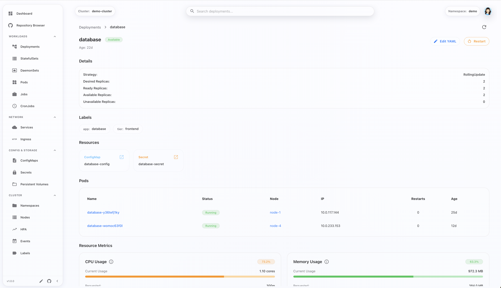
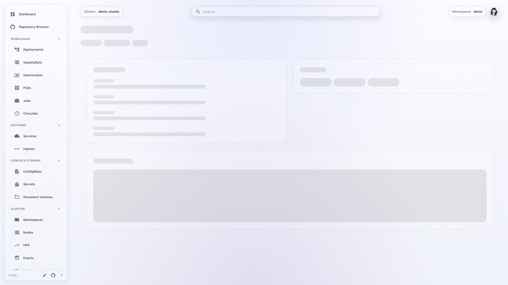
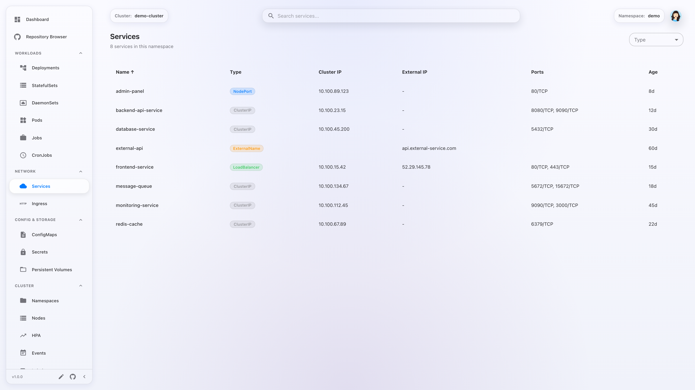
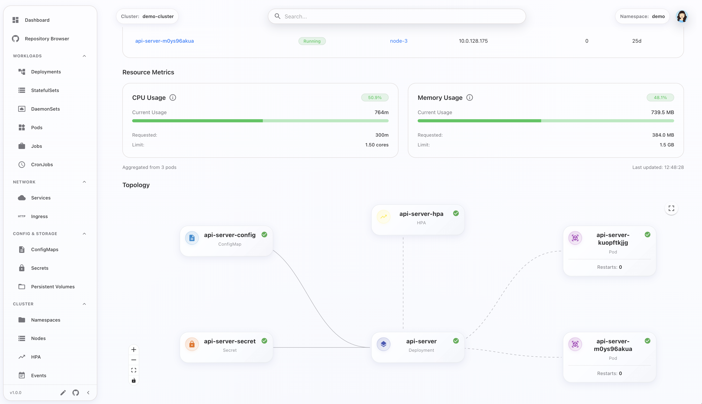
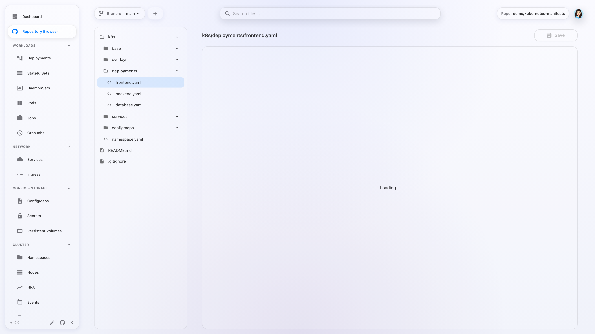
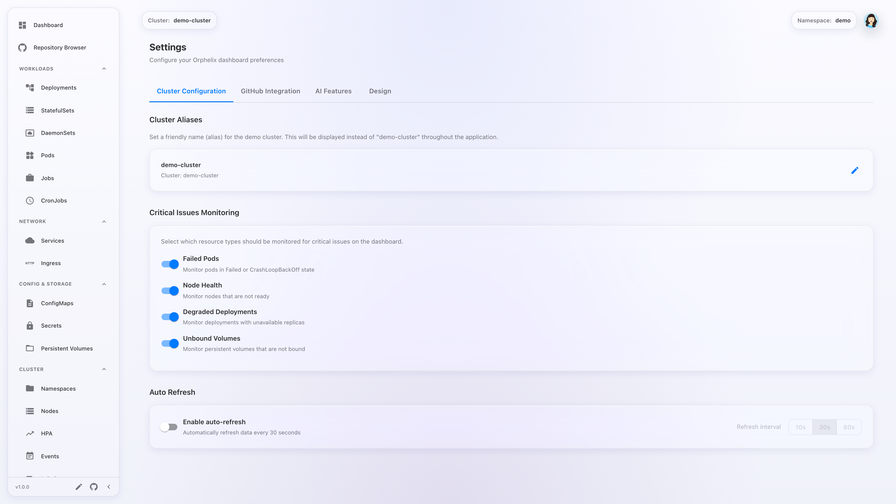

# Screenshots

Auto-generated screenshots of Orphelix in demo mode.

## Welcome modal with mode selection

## Main dashboard with cluster overview

## Deployment detail page with YAML editor

## Pods list view with status badges

## Pod detail page with logs

## Services list view

## Interactive topology graph

## Repository browser with file viewer

## Settings page with theme selection

