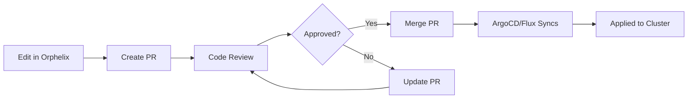

## Overview

Orphelix integrates with GitHub to create and manage Pull Requests (PRs) directly from the dashboard. This enables a complete GitOps workflow where infrastructure changes go through code review before being applied to your cluster.


## What are Pull Requests?

Pull Requests (PRs) are a GitHub feature for:

<CardGroup cols={2}>
  <Card title="Code Review" icon="magnifying-glass">
    Team reviews changes before merging
  </Card>
  <Card title="Discussion" icon="comments">
    Discuss changes, suggest improvements
  </Card>
  <Card title="CI/CD Integration" icon="gears">
    Automated tests run on PR changes
  </Card>
  <Card title="Audit Trail" icon="clock-rotate-left">
    Track who changed what and when
  </Card>
</CardGroup>

## Creating Pull Requests

### From YAML Editor

Most common method - edit manifests and create PR:

<Steps>
  <Step title="Edit YAML">
    Use YAML Editor to modify deployment/config
    
    See [YAML Editor](/user/github/yaml-editor) for details
  </Step>

  <Step title="Review Changes">
    Check diff to ensure changes are correct
    
    
  </Step>

  <Step title="Add Commit Message">
    Write clear, descriptive message:
    
    ```
    Update API gateway to v2.1.0
    
    - Bumps image from v2.0.0 to v2.1.0
    - Adds rate limiting configuration
    - Increases memory limit to handle higher load
    
    Closes #456
    ```
  </Step>

  <Step title="Select Target Branch">
    Choose where to merge changes:
    
    <Tabs>
      <Tab title="Main/Master">
        Default production branch
        
        Most common choice
      </Tab>
      
      <Tab title="Staging">
        Test in staging first
        
        Safer for large changes
      </Tab>
      
      <Tab title="Custom">
        Specific feature branch
        
        For multi-step deployments
      </Tab>
    </Tabs>
  </Step>

  <Step title="Create PR">
    Click **"Create Pull Request"**
    
    Orphelix:
    1. Creates feature branch
    2. Commits your changes
    3. Opens PR on GitHub
    4. Returns PR link
  </Step>
</Steps>

### Multi-file Pull Requests

Create PRs affecting multiple files:


**Use cases:**
- Update ConfigMap + Deployment (apply both changes together)
- Kustomize base + overlay modifications
- Coordinated changes across microservices

<Steps>
  <Step title="Select Multiple Files">
    In Repository Browser, select files with Ctrl+Click
  </Step>

  <Step title="Edit Each File">
    Make changes to all selected files
  </Step>

  <Step title="Review All Changes">
    Diff view shows all modified files
  </Step>

  <Step title="Single Commit">
    All changes in one commit, one PR
  </Step>
</Steps>

### From Repository Browser

Browse and edit repository files directly:

<Steps>
  <Step title="Open Repo Browser">
    Navigate to Repository Browser page
  </Step>

  <Step title="Select Repository">
    Choose GitHub repository from dropdown
  </Step>

  <Step title="Browse Files">
    Navigate file tree to find target file
  </Step>

  <Step title="Edit File">
    Click file, then Edit button
  </Step>

  <Step title="Save and Create PR">
    Save changes → Auto-creates PR
  </Step>
</Steps>

## PR Templates

Orphelix generates structured PR descriptions:

### Default Template

````markdown
## 📦 Changes

Updated Kubernetes resources in namespace: `production`

### Modified Files
- `k8s/deployments/api-gateway.yaml`
- `k8s/configmaps/api-config.yaml`

### Changes Made

**Deployment: api-gateway**
- Updated image from `api:v2.0.0` to `api:v2.1.0`
- Increased memory limit from `512Mi` to `1Gi`
- Added CPU limit: `1000m`

**ConfigMap: api-config**
- Added `RATE_LIMIT_ENABLED=true`
- Updated `MAX_CONNECTIONS=1000`

### Testing Checklist
- [ ] Deploy to staging environment
- [ ] Verify application starts successfully
- [ ] Run integration tests
- [ ] Check resource utilization
- [ ] Validate rate limiting works
- [ ] Monitor error rates

### Rollback Plan
If issues occur:
1. Revert this PR
2. Scale down to 2 replicas
3. Investigate logs in staging

### Related Issues
Closes #456

---
🤖 Generated with [Orphelix](https://github.com/corapoid/orphelix)
````

### Custom Templates

Configure custom PR templates in your repository:

1. Create `.github/pull_request_template.md`
2. Orphelix uses it automatically
3. Override with custom message if needed

## Managing Pull Requests

### Viewing PRs

See all PRs created through Orphelix:


**PR Information:**
- **Title**: PR description
- **Status**: Open, Merged, Closed
- **Author**: Who created PR
- **Created**: When PR was opened
- **Labels**: GitHub labels
- **Reviews**: Review status
- **Checks**: CI/CD status

### PR Status Indicators

<AccordionGroup>
  <Accordion icon="circle-dot" title="Open">
    **Color:** Blue
    
    **Meaning:** PR awaiting review/merge
    
    **Actions:**
    - Review changes
    - Request reviews
    - Merge when ready
  </Accordion>

  <Accordion icon="code-merge" title="Merged">
    **Color:** Purple
    
    **Meaning:** PR successfully merged
    
    **Timeline:**
    - Changes now in target branch
    - ArgoCD/Flux will sync
    - Changes apply to cluster
  </Accordion>

  <Accordion icon="circle-xmark" title="Closed">
    **Color:** Red
    
    **Meaning:** PR closed without merging
    
    **Reasons:**
    - Changes no longer needed
    - Superseded by another PR
    - Incorrect approach
  </Accordion>

  <Accordion icon="triangle-exclamation" title="Conflicts">
    **Color:** Orange
    
    **Meaning:** Merge conflicts exist
    
    **Action required:**
    - Resolve conflicts on GitHub
    - Update branch from base
    - Push resolution
  </Accordion>
</AccordionGroup>

### Review Status

PRs show review state:

<Tabs>
  <Tab title="Pending">
    **Icon:** ⏳
    
    No reviews yet
    
    **Actions:**
    - Request reviews from team
    - Self-review if allowed
  </Tab>

  <Tab title="Approved">
    **Icon:** ✅
    
    Required approvals received
    
    **Actions:**
    - Merge PR
    - Wait for CI checks
  </Tab>

  <Tab title="Changes Requested">
    **Icon:** 🔄
    
    Reviewers requested modifications
    
    **Actions:**
    - Address feedback
    - Push new commits
    - Re-request review
  </Tab>

  <Tab title="Commented">
    **Icon:** 💬
    
    Comments but no approval/rejection
    
    **Actions:**
    - Respond to comments
    - Make suggested changes
  </Tab>
</Tabs>

### CI/CD Checks

View automated check status:


**Common Checks:**

<AccordionGroup>
  <Accordion icon="circle-check" title="YAML Lint">
    Validates YAML syntax
    
    **Pass:** ✅ Valid YAML
    **Fail:** ❌ Syntax errors
  </Accordion>

  <Accordion icon="shield-check" title="Policy Validation">
    Checks against policies (OPA, Kyverno)
    
    **Pass:** ✅ Complies with policies
    **Fail:** ❌ Policy violations
  </Accordion>

  <Accordion icon="vial" title="Integration Tests">
    Runs automated tests
    
    **Pass:** ✅ Tests passed
    **Fail:** ❌ Tests failed
  </Accordion>

  <Accordion icon="lock" title="Security Scan">
    Scans for vulnerabilities
    
    **Pass:** ✅ No vulnerabilities
    **Fail:** ❌ Security issues found
  </Accordion>
</AccordionGroup>

## PR Actions

### Merging

Merge PR to apply changes:

<Steps>
  <Step title="Ensure Approved">
    Required reviews completed
  </Step>

  <Step title="Check Status Checks">
    All CI/CD checks passed
  </Step>

  <Step title="Click Merge">
    In GitHub or Orphelix PR view
  </Step>

  <Step title="Select Merge Method">
    <Tabs>
      <Tab title="Merge Commit">
        Creates merge commit (default)
        
        Preserves full history
      </Tab>
      
      <Tab title="Squash & Merge">
        Combines commits into one
        
        Cleaner history
      </Tab>
      
      <Tab title="Rebase & Merge">
        Replays commits on base
        
        Linear history
      </Tab>
    </Tabs>
  </Step>

  <Step title="Confirm Merge">
    Changes merged to target branch
    
    GitOps operator (ArgoCD/Flux) syncs changes
  </Step>
</Steps>

### Closing without Merging

Close PR if changes not needed:

<Steps>
  <Step title="Add Comment">
    Explain why closing:
    
    ```
    Closing this PR as we decided to handle this in #789 instead
    ```
  </Step>

  <Step title="Click Close">
    PR closed but not deleted
  </Step>

  <Step title="Optional: Delete Branch">
    Clean up feature branch
  </Step>
</Steps>

### Updating PRs

Update PR with new commits:

<Tabs>
  <Tab title="From Orphelix">
    1. Re-open YAML editor
    2. Make additional changes
    3. Save → Commits to same branch
    4. PR automatically updates
  </Tab>

  <Tab title="From Git">
    ```bash
    git checkout feature-branch
    git add .
    git commit -m "Address review feedback"
    git push origin feature-branch
    ```
    
    PR updates automatically
  </Tab>
</Tabs>

## GitOps Workflow

Complete deployment flow with PRs:



### Integration with GitOps Tools

<Tabs>
  <Tab title="ArgoCD">
    **Auto-sync on PR merge:**
    
    1. PR merged to main
    2. ArgoCD detects change
    3. Compares with cluster state
    4. Syncs new manifests
    5. Updates deployment
    
    **ArgoCD App config:**
    ```yaml
    apiVersion: argoproj.io/v1alpha1
    kind: Application
    spec:
      syncPolicy:
        automated:
          prune: true
          selfHeal: true
    ```
  </Tab>

  <Tab title="Flux">
    **GitRepository + Kustomization:**
    
    1. PR merged to main
    2. Flux polls repo (interval: 1m)
    3. Detects new commit
    4. Applies kustomization
    5. Updates cluster
    
    **Flux config:**
    ```yaml
    apiVersion: source.toolkit.fluxcd.io/v1
    kind: GitRepository
    metadata:
      name: app-repo
    spec:
      interval: 1m
      url: https://github.com/org/repo
      ref:
        branch: main
    ```
  </Tab>

  <Tab title="Manual">
    **kubectl apply after merge:**
    
    1. PR merged
    2. CI/CD pipeline triggered
    3. Runs kubectl apply
    4. Changes deployed
    
    **GitHub Action:**
    ```yaml
    - name: Deploy
      run: |
        kubectl apply -f k8s/
    ```
  </Tab>
</Tabs>

## Best Practices

<AccordionGroup>
  <Accordion icon="check" title="Require Reviews">
    Configure branch protection:
    
    ```
    Settings → Branches → Branch Protection Rules
    ✓ Require pull request reviews before merging
    ✓ Require review from Code Owners
    Number of required approvals: 2
    ```
  </Accordion>

  <Accordion icon="check" title="Run CI Checks">
    Automate validation:
    
    ```yaml
    # .github/workflows/validate.yml
    name: Validate
    on: pull_request
    jobs:
      lint:
        runs-on: ubuntu-latest
        steps:
        - uses: actions/checkout@v3
        - name: YAML Lint
          run: yamllint k8s/
    ```
  </Accordion>

  <Accordion icon="check" title="Use Semantic Commits">
    Follow conventional commits:
    
    ```
    feat: Add rate limiting to API gateway
    fix: Correct memory limit causing OOMKills
    chore: Update nginx image to 1.21.6
    docs: Update deployment README
    ```
  </Accordion>

  <Accordion icon="check" title="Link Issues">
    Reference related issues:
    
    ```
    Closes #123
    Related to #456
    Fixes #789
    ```
    
    Auto-closes issues on merge
  </Accordion>

  <Accordion icon="check" title="Test in Staging">
    Deploy to staging before production:
    
    1. Create PR to staging branch
    2. Merge and test
    3. Create PR from staging to main
    4. Merge to production
  </Accordion>

  <Accordion icon="check" title="Small PRs">
    Keep PRs focused:
    
    ✅ One logical change per PR
    ❌ Multiple unrelated changes
    
    Easier to review and safer to merge
  </Accordion>
</AccordionGroup>

## Troubleshooting

### PR Creation Failed

**Symptom:** "Failed to create PR"

**Check:**

1. **Permissions**
   - Orphelix App has write access?
   - Repository not archived?

2. **Branch Conflicts**
   - Branch already exists?
   - Try different branch name

3. **GitHub API Limits**
   - Rate limit exceeded?
   - Wait 1 hour and retry

### Merge Conflicts

**Symptom:** PR shows conflicts

**Resolution:**

<Steps>
  <Step title="View Conflicts">
    Click "Resolve conflicts" on GitHub
  </Step>

  <Step title="Choose Resolution">
    <Tabs>
      <Tab title="Accept Theirs">
        Keep base branch version
      </Tab>
      
      <Tab title="Accept Yours">
        Keep PR branch version
      </Tab>
      
      <Tab title="Manual Edit">
        Combine both changes
      </Tab>
    </Tabs>
  </Step>

  <Step title="Mark Resolved">
    Click "Mark as resolved"
  </Step>

  <Step title="Commit Resolution">
    Commit merge resolution
  </Step>
</Steps>

### CI Checks Failing

**Symptom:** PR blocked by failed checks

**Solutions:**

1. **Review Check Logs**
   - Click "Details" next to failed check
   - Read error messages
   - Fix issues

2. **Common Failures**
   - **YAML Lint**: Fix syntax errors
   - **Policy**: Adjust to meet policies
   - **Tests**: Fix broken tests
   - **Security**: Update vulnerable images

3. **Re-run Checks**
   - Push new commit
   - Or click "Re-run checks"

## Next Steps

<CardGroup cols={2}>
  <Card title="YAML Editor" icon="file-code" href="/user/github/yaml-editor">
    Learn about editing manifests
  </Card>
  <Card title="GitHub Setup" icon="github" href="/user/github/github-app-setup">
    Configure GitHub integration
  </Card>
  <Card title="Deployments" icon="layer-group" href="/user/deployments">
    Back to deployments
  </Card>
  <Card title="Repository Browser" icon="folder-tree" href="/user/repo-browser">
    Browse repository files
  </Card>
</CardGroup>
