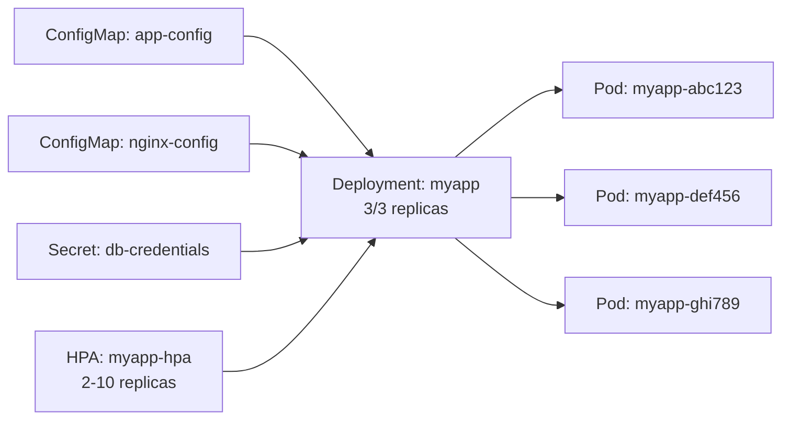

## Overview

The Topology page provides interactive visualization of Kubernetes resource relationships. See how Deployments connect to ConfigMaps, Secrets, HPAs, and Pods in an intuitive graph format.


## What is Topology?

Topology visualization shows the dependency relationships between Kubernetes resources:

<CardGroup cols={2}>
  <Card title="Resource Relationships" icon="diagram-project">
    See how resources connect and depend on each other
  </Card>
  <Card title="Interactive Graph" icon="hand-pointer">
    Click nodes to navigate, drag to rearrange, zoom to focus
  </Card>
  <Card title="Configuration Flow" icon="arrow-right">
    Track ConfigMaps and Secrets to consuming resources
  </Card>
  <Card title="Autoscaling Links" icon="arrows-up-down">
    Visualize HPA relationships with workloads
  </Card>
</CardGroup>

## Cluster-wide Topology

View relationships across all resources in the namespace:


### Node Types

<AccordionGroup>
  <Accordion icon="layer-group" title="Deployment Nodes">
    **Visual:** Purple rounded rectangle
    
    **Shows:**
    - Deployment name
    - Replica count (e.g., "3/3")
    - Status indicator
    
    **Connections:**
    - → ConfigMaps (mounted or env vars)
    - → Secrets (mounted or env vars)
    - → HPA (if autoscaling configured)
    - → Pods (managed pods)
  </Accordion>

  <Accordion icon="file-code" title="ConfigMap Nodes">
    **Visual:** Blue document icon
    
    **Shows:**
    - ConfigMap name
    - Number of data keys
    
    **Connections:**
    - ← Deployments (consumers)
    - ← StatefulSets
    - ← DaemonSets
    - ← Pods
  </Accordion>

  <Accordion icon="key" title="Secret Nodes">
    **Visual:** Green lock icon
    
    **Shows:**
    - Secret name
    - Secret type (Opaque, TLS, etc.)
    
    **Connections:**
    - ← Deployments (consumers)
    - ← StatefulSets
    - ← DaemonSets
    - ← Pods
  </Accordion>

  <Accordion icon="arrows-up-down" title="HPA Nodes">
    **Visual:** Orange scaling icon
    
    **Shows:**
    - HPA name
    - Min/max replicas
    - Current CPU %
    
    **Connections:**
    - → Deployment (target resource)
  </Accordion>

  <Accordion icon="cube" title="Pod Nodes">
    **Visual:** Gray cube icon
    
    **Shows:**
    - Pod name (shortened)
    - Status (Running, Pending, etc.)
    
    **Connections:**
    - ← Deployment (owner)
    - → ConfigMaps (if directly mounted)
    - → Secrets (if directly mounted)
  </Accordion>
</AccordionGroup>

### Edge Types

Connections between nodes indicate relationships:

<Tabs>
  <Tab title="Uses">
    **Line Style:** Solid arrow
    
    **Meaning:** Resource uses/depends on another
    
    **Examples:**
    - Deployment → ConfigMap (mounts config)
    - Deployment → Secret (uses credentials)
    
    **Color:** Blue
  </Tab>

  <Tab title="Manages">
    **Line Style:** Dashed arrow
    
    **Meaning:** Resource creates/controls another
    
    **Examples:**
    - Deployment → Pod (creates pods)
    - ReplicaSet → Pod (manages pods)
    
    **Color:** Gray
  </Tab>

  <Tab title="Scales">
    **Line Style:** Bold arrow
    
    **Meaning:** HPA scales target resource
    
    **Examples:**
    - HPA → Deployment (autoscales)
    
    **Color:** Orange
  </Tab>
</Tabs>

## Deployment-specific Topology

Each deployment detail page includes a focused topology view:


### Focused View

Shows only resources related to the specific deployment:

**Center Node:** The deployment itself

**Connected Resources:**
- **Left side:** ConfigMaps and Secrets used
- **Right side:** HPA (if configured)
- **Bottom:** Pods managed by deployment

### Example Layout



## Interactive Features

### Navigation

<Steps>
  <Step title="Click Nodes">
    Click any node to navigate to its detail page
    
    - ConfigMap → ConfigMap detail page
    - Deployment → Deployment detail page
    - Pod → Pod detail page with logs
  </Step>

  <Step title="Hover for Info">
    Hover over nodes for quick information tooltip:
    
    - Resource status
    - Key metrics
    - Age
    - Labels (first 3)
  </Step>

  <Step title="Right-click Menu">
    Right-click nodes for actions:
    
    - View details
    - Edit YAML
    - View logs (pods)
    - Restart (deployments/pods)
  </Step>
</Steps>

### Graph Controls

<Tabs>
  <Tab title="Pan">
    **Action:** Click and drag background
    
    **Use:** Move view to see different parts of large graphs
    
    **Keyboard:** Arrow keys
  </Tab>

  <Tab title="Zoom">
    **Action:** Mouse wheel or pinch gesture
    
    **Use:** Zoom in for detail, zoom out for overview
    
    **Buttons:** + / - buttons in top-right corner
    
    **Keyboard:** Ctrl + wheel
  </Tab>

  <Tab title="Fit View">
    **Action:** Double-click background or click fit button
    
    **Use:** Auto-zoom to show all nodes
    
    **Keyboard:** F key
  </Tab>

  <Tab title="Select">
    **Action:** Click node to select, Shift+Click for multi-select
    
    **Use:** Highlight related resources
    
    **Keyboard:** Ctrl+A (select all)
  </Tab>
</Tabs>

### Layout Options

Choose how nodes are arranged:

<AccordionGroup>
  <Accordion icon="arrows-left-right" title="Horizontal (Default)">
    Flows left to right
    
    - ConfigMaps/Secrets on left
    - Deployment in center
    - Pods on right
    
    **Best for:** Deployments with few dependencies
  </Accordion>

  <Accordion icon="arrows-up-down" title="Vertical">
    Flows top to bottom
    
    - ConfigMaps/Secrets on top
    - Deployment in middle
    - Pods on bottom
    
    **Best for:** Many pods, narrow screens
  </Accordion>

  <Accordion icon="circle-nodes" title="Radial">
    Deployment at center, resources radiating outward
    
    - ConfigMaps/Secrets in ring 1
    - Pods in ring 2
    
    **Best for:** Complex relationships, many resources
  </Accordion>

  <Accordion icon="diagram-project" title="Force-directed">
    Physics simulation pushes/pulls nodes
    
    - Related nodes cluster together
    - Unrelated nodes pushed apart
    
    **Best for:** Discovering unexpected relationships
  </Accordion>
</AccordionGroup>

## Status Indicators

Nodes show status with color coding:

<Tabs>
  <Tab title="Healthy">
    **Color:** Green border
    
    **Meaning:**
    - Deployment: All replicas available
    - Pod: Running normally
    - ConfigMap/Secret: No errors
    - HPA: Operating within targets
    
    <Note>
      Healthy resources have solid green border
    </Note>
  </Tab>

  <Tab title="Warning">
    **Color:** Yellow/orange border
    
    **Meaning:**
    - Deployment: Some replicas unavailable
    - Pod: Restarting frequently
    - HPA: Near min/max limits
    
    <Warning>
      Warning state indicates potential issues
    </Warning>
  </Tab>

  <Tab title="Error">
    **Color:** Red border
    
    **Meaning:**
    - Deployment: No replicas available
    - Pod: Failed, CrashLoopBackOff
    - ConfigMap/Secret: Mount errors
    - HPA: Cannot scale (no metrics)
    
    <Warning>
      Error state requires immediate attention
    </Warning>
  </Tab>

  <Tab title="Unknown">
    **Color:** Gray border
    
    **Meaning:**
    - Status cannot be determined
    - Resource being created
    - Connection issues
  </Tab>
</Tabs>

## Use Cases

### Configuration Management

Track which resources use specific ConfigMaps:

<Steps>
  <Step title="Find ConfigMap Node">
    Locate ConfigMap in topology graph
  </Step>

  <Step title="Follow Edges">
    See all Deployments/Pods using this config
  </Step>

  <Step title="Plan Updates">
    Identify which resources will be affected by config changes
  </Step>

  <Step title="Restart Affected">
    Navigate to each consumer and restart to apply changes
  </Step>
</Steps>

### Secret Rotation

Visualize secret dependencies before rotation:

```
Secret: api-key
├─→ Deployment: frontend (3 pods)
├─→ Deployment: backend (5 pods)
└─→ CronJob: nightly-sync (1 job)

Action: Update secret, restart all 3 resources
```

### Troubleshooting Dependencies

Investigate why deployment fails:

<Steps>
  <Step title="View Deployment Topology">
    Open deployment detail page topology section
  </Step>

  <Step title="Check ConfigMaps">
    Are all ConfigMaps present? (green borders)
    
    Missing ConfigMap = red border → Pod stuck in ContainerCreating
  </Step>

  <Step title="Check Secrets">
    Are secrets accessible?
    
    Missing Secret = Pod cannot mount volumes
  </Step>

  <Step title="Check HPA">
    Is HPA functioning?
    
    HPA error = Cannot scale, may be under/over-provisioned
  </Step>
</Steps>

### Capacity Planning

Understand autoscaling impact:

```
HPA: myapp-hpa (2-10 replicas, target: 80% CPU)
└─→ Deployment: myapp
    ├─→ Pod: myapp-1 (CPU: 75%)
    ├─→ Pod: myapp-2 (CPU: 75%)
    └─→ Pod: myapp-3 (CPU: 75%)

Analysis: Near target, may scale up soon
Action: Pre-emptively add node capacity
```

## Advanced Features

### Filtering

Filter topology to show specific resource types:

<Tabs>
  <Tab title="All Resources">
    Show complete topology (default)
  </Tab>

  <Tab title="Configuration Only">
    Show only ConfigMaps and Secrets
    
    Use for: Configuration audit
  </Tab>

  <Tab title="Workloads Only">
    Show only Deployments, Pods, HPAs
    
    Use for: Capacity analysis
  </Tab>

  <Tab title="Failed Resources">
    Show only resources with errors
    
    Use for: Troubleshooting
  </Tab>
</Tabs>

### Search

Find specific resources in large topologies:

```
Search: "redis"
Result: Highlights all nodes containing "redis"
```

**Search features:**
- Partial name matching
- Case-insensitive
- Highlights matching nodes
- Auto-pan to first match

### Export

Export topology for documentation:

<AccordionGroup>
  <Accordion icon="image" title="Export as PNG">
    Download topology as image
    
    Use for:
    - Documentation
    - Presentations
    - Incident reports
  </Accordion>

  <Accordion icon="file-code" title="Export as SVG">
    Download as scalable vector graphic
    
    Use for:
    - High-resolution documentation
    - Editing in design tools
  </Accordion>

  <Accordion icon="file-lines" title="Export as JSON">
    Download graph data structure
    
    Use for:
    - Programmatic analysis
    - Custom visualizations
    - Backup/versioning
  </Accordion>
</AccordionGroup>

## Best Practices

<AccordionGroup>
  <Accordion icon="check" title="Regular Topology Review">
    Check topology weekly to:
    - Identify unused ConfigMaps/Secrets
    - Find orphaned resources
    - Verify HPA configuration
    - Plan resource cleanup
  </Accordion>

  <Accordion icon="check" title="Use for Impact Analysis">
    Before making changes:
    1. View affected resource in topology
    2. Identify all dependencies
    3. Plan rollout order
    4. Document affected services
  </Accordion>

  <Accordion icon="check" title="Document Critical Paths">
    Screenshot topologies for:
    - Production service dependencies
    - Configuration hierarchies
    - Disaster recovery planning
  </Accordion>

  <Accordion icon="check" title="Color Code by Environment">
    Use labels to distinguish:
    - Production (red labels)
    - Staging (yellow labels)
    - Development (green labels)
    
    Nodes automatically colored by label
  </Accordion>
</AccordionGroup>

## Limitations

<Warning>
  **Current limitations:**
  - Only shows resources in current namespace
  - Cross-namespace dependencies not visualized
  - Service connections not shown
  - Ingress rules not displayed
  - PVC → PV relationships not included
</Warning>

## Next Steps

<CardGroup cols={2}>
  <Card title="Deployments" icon="layer-group" href="/user/deployments">
    View deployment-specific topology
  </Card>
  <Card title="ConfigMaps & Secrets" icon="key" href="/user/configmaps-secrets">
    Manage configuration resources
  </Card>
  <Card title="HPA" icon="arrows-up-down" href="/user/hpa">
    Configure autoscaling
  </Card>
  <Card title="Dashboard" icon="chart-line" href="/user/dashboard">
    View topology on dashboard
  </Card>
</CardGroup>
